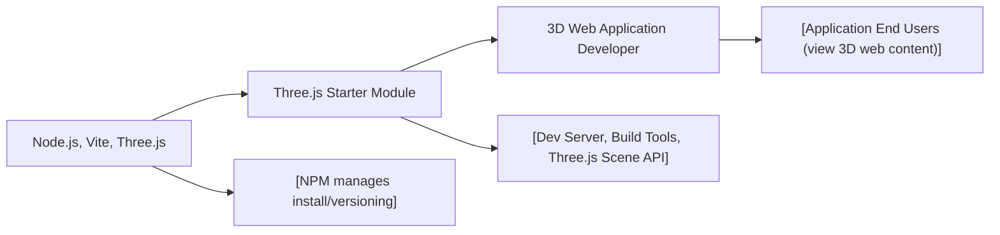

# Three.js Starter Module

## Overview
The Three.js Starter Module provides a ready-to-use development environment for creating 3D web experiences using the Three.js library. It leverages Vite as a fast bundler and serves as a foundation for rapid prototyping and building Three.js applications. This module streamlines setup, local development, and production builds for projects utilizing Three.js.

## Key Features
- **Pre-configured Three.js Environment**: Out-of-the-box setup with Three.js and minimal configuration required.
- **Vite Development Server**: Fast local development server with hot module replacement for instant feedback.
- **Production Build Process**: Generates optimized static assets for deployment using Vite’s build system.
- **Simple NPM Task Management**: Streamlined commands for dependency installation, dev server, and builds.

## System Errors
- **Dependency Installation Error**: Occurs if Node.js or required packages are missing.  
  *Resolution*: Ensure [Node.js](https://nodejs.org/en/download/) is installed and run `npm install` in the project directory.
- **Port in Use Error (8080)**: Local server fails to start because port 8080 is already occupied.  
  *Resolution*: Close other services using the port or configure Vite to use a different port.
- **Missing Three.js Import Error**: Import statements for Three.js fail if dependencies were not installed.  
  *Resolution*: Run `npm install` to install all dependencies per the setup instructions.

## Usage Examples
Practical code examples showing how to use the module:

```bash
# 1. Install all dependencies (run only once after cloning)
npm install

# 2. Start the local development server (default: http://localhost:8080)
npm run dev

# 3. Build the project for production (output in 'dist/')
npm run build
```

Example usage in a Three.js scene source file:
```js
// src/main.js
import * as THREE from 'three';

const scene = new THREE.Scene();
// ... set up camera, renderer, and add 3D objects
```

## System Integration

