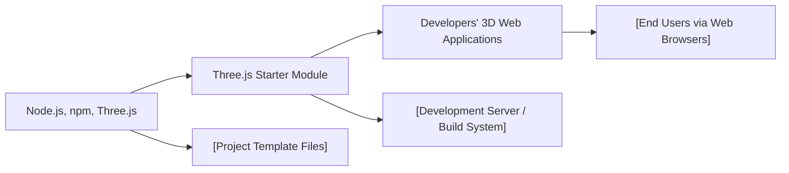

# Three.js Starter Module

## Overview
The Three.js Starter Module provides a convenient entry point for developing 3D web applications using the Three.js library. It handles project setup, dependency management, development server configuration, and production builds, streamlining the process of starting a Three.js-based project. This module is designed to enable rapid prototyping, local development, and easy deployment of interactive 3D experiences.

## Key Features
- **Dependency Management**: Automatically installs all required packages and dependencies for Three.js development, ensuring your environment is ready without manual setup.
- **Development Server**: Launches a local server (by default at `localhost:8080`) with live reloading, enabling quick feedback during development.
- **Production Build System**: Bundles and optimizes the application for deployment, producing output in the `dist/` directory, ready for distribution or hosting.
- **Cross-platform Project Bootstrapping**: Simplifies project initiation, ensuring consistent environments across different machines and operating systems.

## System Errors
- **Missing Dependencies**: Occurs if dependencies are not installed.  
  *Resolution*: Run `npm install` before starting the development server or build process.
- **Port in Use**: If `localhost:8080` is already occupied by another process, the development server may fail to start.  
  *Resolution*: Stop the conflicting process or modify the server configuration to use a different port.
- **Build Failures**: Errors during `npm run build` usually point to missing files, syntax errors, or misconfigured modules.  
  *Resolution*: Check the terminal output for specifics, ensure all source files exist, and fix any reported issues.

## Usage Examples

```bash
# Initial setup: install all project dependencies
npm install

# Start the development server (access via http://localhost:8080)
npm run dev

# Build for production (output in dist/ directory)
npm run build
```

## System Integration


