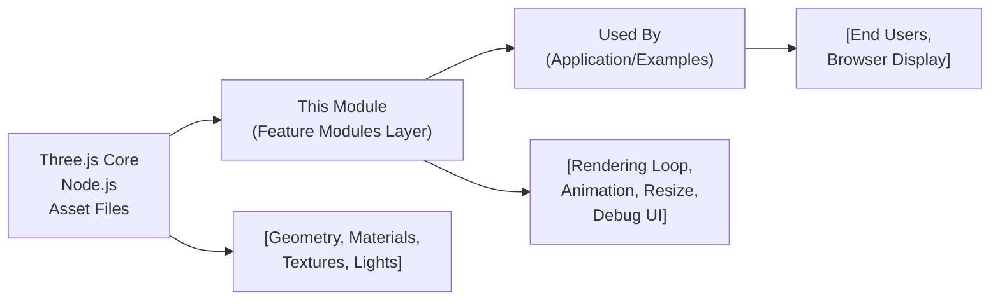

# Three.js Feature Modules

## Overview
This project is a modular Three.js learning environment, where each folder represents a standalone module focused on a critical 3D graphics concept—such as Cameras, Materials, Lights, Animation, Debug UI, and more. The design allows you to explore, test, and combine these features to build rich interactive 3D experiences in the browser. Each module exposes standard integration points and coordinates via the main application rendering loop.

## Key Features

- **Camera Module**: Provides virtual camera controls (perspective, orthographic, movement) for navigating and viewing the 3D scene.
- **Materials Module**: Adds and manages material properties to geometries, controlling surface appearance, reflectivity, and style.
- **Lights Module**: Handles scene illumination with various light types, creating depth, shading, and atmosphere.
- **Geometries Module**: Supplies a suite of 3D shapes (primitives, custom geometry) for scene composition and modeling.
- **Texture Module**: Enables importing, applying, and manipulating textures on surfaces for realism and details.
- **Animation Module**: Organizes and runs object/keyframe animations for dynamic scene elements.
- **3D Text Module**: Renders customizable 3D text meshes for UI, titles, and labels within your scene.
- **FullScreen Resize Module**: Ensures rendering adapts to dynamic window size or device orientation changes, maintaining scene fidelity.
- **Transform Module**: Provides unified controls for rotating, scaling, and moving objects within the scene graph.
- **Debug UI Module**: Integrates development-focused user interface controls for adjusting scene parameters in real time.
- **GoLive/Starter Module**: Bootstraps the project environment, exposing commands for development, live reloading, and production builds.

## System Errors

- **Module Not Initialized**: Occurs if a feature module is used before calling its setup/init function.  
  _Resolution_: Ensure all required modules are initialized during application bootstrapping.
- **Missing Dependency**: Triggered when one module relies on another (e.g., Materials needs Geometries) that has not been loaded.  
  _Resolution_: Check integration order and import dependencies before usage.
- **Texture Load Failure**: Displays if a texture resource fails to load or is invalid.  
  _Resolution_: Inspect file paths and supported file formats.
- **WebGL Context Lost**: Happens when the browser loses GPU context, pausing rendering.  
  _Resolution_: Reload the page or restore context if possible.
- **Resize Event Error**: When FullScreen Resize module isn't connected properly, scene may stretch or break on window resize.  
  _Resolution_: Attach resize handler on startup and verify renderer/camera are correctly updated.

## Usage Examples

```js
// Initialize and use core modules
import { initCamera } from './Camera';
import { addLight } from './Lights';
import { createGeometry } from './Geometries';
import { setMaterial } from './Materials';
import { loadTexture } from './Texture';
import { animate } from './Animation';
import { renderText3D } from './3DText';
import { enableResize } from './FullScreen Resize';
import { setTransform } from './Transform';
import { enableDebugUI } from './Debug UI';

// Setup application
initCamera({ fov: 75, aspect: window.innerWidth / window.innerHeight });
addLight({ type: 'directional', intensity: 1 });
const mesh = createGeometry('cube');
setMaterial(mesh, { color: 0xff0000 });
loadTexture(mesh, 'assets/wood.jpg');
renderText3D('Hello Three.js', { position: [0,2,0] });
animate(mesh, { rotation: [0, Math.PI, 0], duration: 2000 });
setTransform(mesh, { position: [1, 0, 1], scale: [2, 2, 2] });
enableDebugUI();
enableResize();

function renderLoop() {
  // typical Three.js render/update loop
  requestAnimationFrame(renderLoop);
  // update animations, render scene, etc.
}
renderLoop();
```

## System Integration


