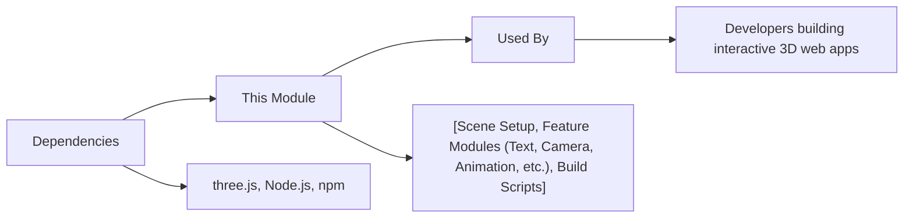

# Three.js Feature Modules

## Overview
This repository provides a collection of modular features for accelerating Three.js-based 3D web development. Each module isolates a specific concern—such as camera setup, animation, materials, or text rendering—so you can quickly assemble a complete interactive 3D scene. The approach is feature-centric: each module focuses on delivering a user-facing capability, integrating smoothly with other modules, and enabling developers to rapidly prototype or extend 3D scenes.

## Key Features
- **Starter**: Initializes the core Three.js environment, manages dependencies, and provides standardized build and development scripts.
- **3D Text**: Enables rendering of dynamic 3D text objects within your scene, supporting various fonts and material customizations.
- **Animation**: Provides utilities for animating objects and camera, supporting timeline-based or frame-driven updates to bring scenes to life.
- **Camera**: Supplies camera setup and management, supporting perspective and orthographic projections, as well as camera controls for user interaction.
- **Debug UI**: Integrates debugging and visualization tools into your scene, allowing for real-time inspection and value tweaking.
- **FullScreen Resize**: Automatically handles adaptive resizing of the renderer and camera when the browser window or device orientation changes.
- **Geometries**: Catalogs a variety of geometric meshes (spheres, cubes, planes, etc.) for quick addition and experimentation in scenes.
- **GoLive**: Utilities for deploying Three.js projects to production, with build optimization and asset bundling.
- **Lights**: Manages different lighting types (ambient, point, directional, etc.) to illuminate and enhance your 3D scenes.
- **Materials**: Comprehensive support for material creation and assignment, enabling realistic or stylized rendering of objects.
- **Texture**: Facilitates loading, managing, and applying 2D and environment textures to 3D objects for enhanced realism.
- **Transform**: High-level abstractions for positioning, rotating, and scaling 3D objects within the scene.

## System Errors
- **Dependency Installation Failure**: If `npm install` fails, ensure Node.js and npm are installed and versions are compatible with the project requirements.
- **Local Server Not Starting (`npm run dev`)**: Confirm no other process is using port 8080, and that dependencies are fully installed.
- **Build Output Missing or Incomplete**: If `dist/` is empty after `npm run build`, check for build configuration errors or missing assets.
- **Missing WebGL Support**: If rendering fails, verify that the browser supports WebGL and that no security policies block 3D rendering.
- **Module Import Errors**: Ensure all module paths are correct, and required modules are exported properly.

## Usage Examples

```bash
# Install all dependencies for all modules (run at repo root)
npm install

# Start the development server (default: localhost:8080)
npm run dev

# Build the project for production; output goes to 'dist/'
npm run build
```

```js
// Example: Adding a 3D text object and animating it
import { initScene } from 'Starter'
import { add3DText } from '3DText'
import { animateObject } from 'Animation'
import { setupCamera } from 'Camera'
import { addLight } from 'Lights'

const scene = initScene()
const camera = setupCamera()
addLight(scene, { type: 'directional', intensity: 1 })

const textMesh = add3DText(scene, {
  text: 'Hello, Three.js!',
  size: 2,
  color: '#00ffcc'
})

// Animate the text mesh
animateObject(textMesh, { rotationY: Math.PI * 2, duration: 5 })
```

## System Integration


