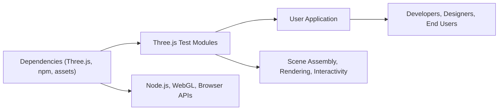

# Three.js Test Modules

## Overview
This repository contains modular features built on top of [Three.js](https://threejs.org/), designed to help developers rapidly prototype, visualize, and interact with 3D scenes in the browser. Each module targets a specific aspect of 3D scene creation—ranging from geometry, materials, lighting, and camera controls, to animation, debugging tools, and responsive behaviors. These modules are intended to be used together or selectively, providing a flexible foundation for building interactive 3D applications.

## Key Features

- **Geometry Module**: Provides reusable 3D shapes (primitives and complex forms) for scene construction, enabling streamlined object creation.
- **Material Module**: Offers ready-to-use and customizable surface materials for 3D objects, supporting a wide range of visual effects.
- **Lighting Module**: Controls and configures different lighting types for realistic or stylized scene illumination.
- **Camera Module**: Includes utilities for camera setup, movement, and controls, supporting different perspectives and navigation patterns.
- **Texture Module**: Facilitates the loading and application of textures to objects, enhancing realism or achieving unique styles.
- **Animation Module**: Enables animation of objects, camera, and scene parameters for dynamic and interactive visualizations.
- **Transform Module**: Provides features for moving, rotating, and scaling 3D objects through code or user input.
- **3DText Module**: Allows rendering of text in 3D space, useful for labels, UI elements, or interactive markers.
- **Debug UI Module**: Integrates a user interface for debugging and tweaking scene parameters in real time.
- **FullScreen Resize Module**: Ensures the 3D canvas responsively fits the browser window, adapting to size changes automatically.
- **Starter Module**: Sets up a basic Three.js scene and handles core application lifecycle for easy project initiation.
- **GoLive Module**: Prepares and optimizes the application for deployment in production environments or live demos.

## System Errors

- **Missing Dependency**: Three.js or essential library is not installed.<br>
  *Resolution*: Run `npm install` to ensure all dependencies are present.

- **WebGL Context Failure**: Browser does not support WebGL or 3D rendering.<br>
  *Resolution*: Verify browser compatibility. Ensure that hardware acceleration is enabled.

- **Texture Loading Error**: Texture assets not found or unable to load.<br>
  *Resolution*: Check asset paths, server configuration, and resolve CORS issues.

- **Invalid Scene Parameters**: Incorrect values passed to geometries, materials, lights, etc.<br>
  *Resolution*: Validate input and refer to Three.js documentation for correct parameter formats.

## Usage Examples

```js
// Import core Three.js and desired modules
import * as THREE from 'three';
// Example: using modular features (pseudo-imports, adjust per your structure)
import { createBoxGeometry } from './Geometries';
import { createBasicMaterial } from './Materials';
import { setupLights } from './Lights';
import { setupCamera } from './Camera';

// Create core scene
const scene = new THREE.Scene();

// Add geometry with material
const geometry = createBoxGeometry(1, 1, 1);
const material = createBasicMaterial({ color: 0x00ff00 });
const cube = new THREE.Mesh(geometry, material);
scene.add(cube);

// Add lighting and camera
setupLights(scene);
const camera = setupCamera({ fov: 75, aspect: window.innerWidth/window.innerHeight });

// Set up renderer
const renderer = new THREE.WebGLRenderer();
renderer.setSize(window.innerWidth, window.innerHeight);
document.body.appendChild(renderer.domElement);

// Render loop
function animate() {
  requestAnimationFrame(animate);
  cube.rotation.x += 0.01; // Animation module can also be used here
  cube.rotation.y += 0.01;
  renderer.render(scene, camera);
}
animate();
```

## System Integration


