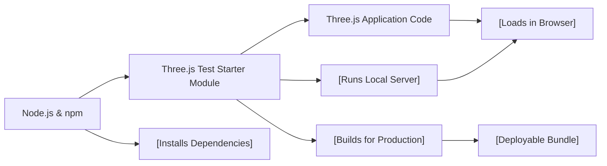

# Three.js Test Starter Module

## Overview
The Three.js Test Starter module provides a ready-to-use development environment for experimenting with Three.js projects. It streamlines the process of setting up, serving, and building Three.js applications by offering scripts and configurations that automate dependency management and project builds.

## Key Features
- **Development Server**: Instantly launches a local server, enabling rapid development and real-time previews of Three.js scenes.
- **Production Build**: Generates an optimized build of your project, suitable for deployment, under the `dist/` directory.
- **Automated Dependency Management**: Handles all necessary npm dependencies, reducing setup friction and ensuring environment consistency.

## System Errors
- **Missing Dependencies**: Occurs if `npm install` is not run before development/build commands.  
  *Resolution*: Run `npm install` in the project root to install all required dependencies.
- **Port Conflict on Dev Server**: If port `8080` is already in use, the development server fails to start.  
  *Resolution*: Close the application using the port or configure the dev server to use a different port.
- **Build Failures**: Errors during `npm run build` often relate to missing files or misconfigured project structure.  
  *Resolution*: Verify the project structure matches expected entry points and all source files exist.

## Usage Examples
Practical workflow for typical Three.js project development:

```bash
# 1. Install Node.js from https://nodejs.org/en/download/ (if not present)

# 2. Install all project dependencies (run this once)
npm install

# 3. Start the local development server (default at http://localhost:8080)
npm run dev

# 4. Build the project for production (output in "dist/" directory)
npm run build
```

## System Integration


