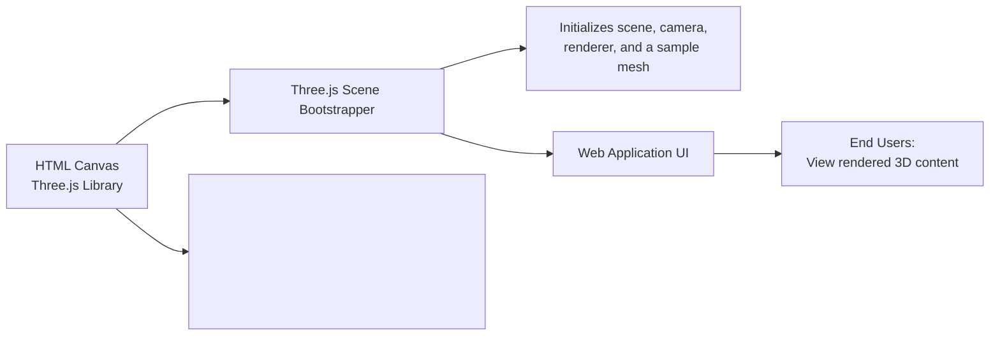

# Three.js WebGL Scene Bootstrapper

## Overview
This module bootstraps a basic 3D scene using Three.js, rendering a simple red cube within an HTML canvas. It provides a starting point for integrating 3D graphics into web applications by demonstrating the essential steps to create, display, and configure a 3D scene.

## Key Features
- **Canvas Integration**: Binds a `<canvas>` element on an HTML page to a Three.js WebGL context, enabling graphical rendering within standard web layouts.
- **Scene Initialization**: Sets up a Three.js `Scene` object, which acts as a container for all 3D objects, lights, and cameras.
- **Mesh Creation**: Instantiates a basic red cube (using `BoxGeometry` and `MeshBasicMaterial`) and adds it to the scene, showcasing object creation and scene management.
- **Camera Setup**: Configures a perspective camera with an adjustable field of view and aspect ratio, defining the viewer's perspective.
- **WebGL Renderer Configuration**: Initializes a renderer, links it to the HTML canvas, and sets dimensions to match the specified scene size for optimal display.
- **Immediate Scene Rendering**: Performs a one-time rendering of the scene from the camera’s viewpoint.

## System Errors
- **Canvas Not Found**: If `document.querySelector('canvas.webgl')` returns `null`, initialization will fail, resulting in runtime errors when creating the renderer.
  - **Resolution**: Ensure that the HTML contains a `<canvas class="webgl">` element before loading the script.
- **Invalid Renderer Size**: Setting an incorrect width/height may cause the rendered scene to appear stretched or improperly scaled.
  - **Resolution**: Adjust the `sizes` configuration to match both the target display and camera aspect ratio.

## Usage Examples

```js
// In your HTML, include the following canvas element
// <canvas class="webgl"></canvas>

// script.js

import * as THREE from 'three'

// Select canvas for rendering
const canvas = document.querySelector('canvas.webgl')

// Create a scene
const scene = new THREE.Scene()

// Create a red cube and add it to the scene
const geometry = new THREE.BoxGeometry(1, 1, 1)
const material = new THREE.MeshBasicMaterial({ color: 0xff0000 })
const mesh = new THREE.Mesh(geometry, material)
scene.add(mesh)

// Define viewport size
const sizes = { width: 800, height: 600 }

// Set up a perspective camera
const camera = new THREE.PerspectiveCamera(75, sizes.width / sizes.height)
camera.position.z = 3
scene.add(camera)

// Create a renderer, link it to the canvas, and render the scene
const renderer = new THREE.WebGLRenderer({ canvas: canvas })
renderer.setSize(sizes.width, sizes.height)
renderer.render(scene, camera)
```

## System Integration


