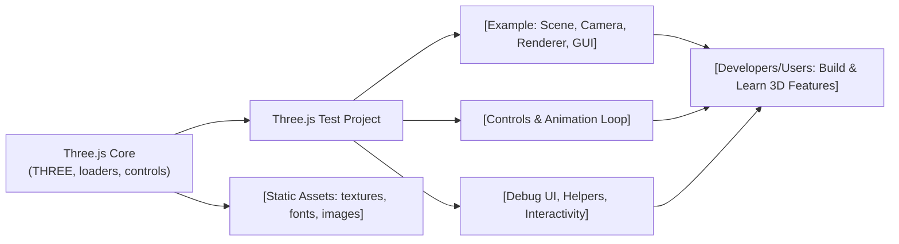

# Three.js Test Project API Overview

## Overview
The Three.js Test Project is a modular collection of example modules, each showcasing a specific interactive or rendering feature built with [Three.js](https://threejs.org/). The modules are organized by topic to demonstrate core concepts such as object creation, animation, camera controls, materials, lighting, geometries, text rendering, full screen/resizing, texture management, and debugging UI. The collection is intended as a reference and educational toolkit, not a framework or standalone API. 

The system's purpose is to help developers understand how individual Three.js features integrate into real web applications, and how these building blocks are combined for richer 3D experiences.

## Key Features

- **Starter Scene**: Provides the foundational setup for a Three.js application, including basic scene, camera, renderer, and a simple mesh.
- **3D Text Rendering**: Demonstrates how to load fonts and render 3D text and shapes with materials and random positioning.
- **Animation Loop**: Shows how to animate scene objects using the Three.js clock and animation techniques (e.g., GSAP integration).
- **Camera Types & Controls**: Explains the use of different camera types (Perspective, Orthographic), camera transformations, and interactive orbit controls.
- **Debug UI Integration**: Integrates a UI for real-time property tweaking (via `lil-gui`) to adjust object and material parameters during runtime.
- **Dynamic Fullscreen & Responsive Resize**: Handles user-driven fullscreen toggling and responsive canvas resizing to match the display.
- **Geometries Exploration**: Illustrates advanced geometry construction, including custom buffer attributes and wireframe rendering.
- **GoLive Example**: Puts together multiple features (text, shapes, controls, GUI) into an interactive demo.
- **Lighting Configurations**: Demonstrates different lighting types, helpers, and debugging overlays to illuminate 3D objects in a scene.
- **Material System**: Loads and applies a variety of textures and advanced material settings, including environmental lighting and physically-based rendering.
- **Texture Loading & Management**: Uses Three.js loaders and a loading manager to handle complex texture setups, including progress/error tracking.
- **Object Transformation & Hierarchies**: Shows transformations (scale, rotation, grouping) and the use of helpers (axes) for visual debugging.

## System Errors

- **Asset Loading Failure**: 
  - *Description*: Errors may occur if texture or font assets are missing, incorrectly referenced, or paths are broken.
  - *Resolution*: Ensure all referenced assets exist at specified paths; check for typos in file paths and correct server configuration.

- **Incorrect Canvas Sizing/Aspect Ratio**:
  - *Description*: Camera or renderer may misbehave when the browser window is resized or on high-DPI screens.
  - *Resolution*: Ensure resize listeners update both camera's aspect and renderer size/pixel ratio. Always use `window.innerWidth/innerHeight`.

- **WebGL Context Errors**:
  - *Description*: Occurs if the browser doesn't support WebGL or context is lost.
  - *Resolution*: Test in a WebGL-enabled browser; check for context loss events and handle with fallback/error UI.

- **Shader or Material Incompatibility**:
  - *Description*: Experimental, advanced, or incomplete Three.js features (like certain material properties) may not work on all devices.
  - *Resolution*: Test with fallback materials and check browser/device compatibility.

- **Fullscreen API Limitations**:
  - *Description*: Fullscreen toggling may not work on all browsers due to vendor-specific API implementations.
  - *Resolution*: Provide fallbacks (`webkitRequestFullscreen`), and notify users on failure.

## Usage Examples

```js
// Starter: Minimal Setup
import * as THREE from 'three';
const canvas = document.querySelector('canvas.webgl');
const scene = new THREE.Scene();
const geometry = new THREE.BoxGeometry(1, 1, 1);
const material = new THREE.MeshBasicMaterial({ color: 0xff0000 });
const mesh = new THREE.Mesh(geometry, material);
scene.add(mesh);
// Camera & Renderer setup ...
```

```js
// 3D Text with OrbitControls and GUI
import { FontLoader } from 'three/examples/jsm/loaders/FontLoader.js';
import { OrbitControls } from 'three/examples/jsm/controls/OrbitControls.js';
import GUI from 'lil-gui';
const gui = new GUI();
const fontLoader = new FontLoader();
fontLoader.load('/fonts/helvetiker_regular.typeface.json', font => {
  // build and add 3D text mesh
});
const controls = new OrbitControls(camera, canvas);
```

```js
// Dynamic Resize & Fullscreen
window.addEventListener('resize', () => {
  // Update size, camera aspect, and renderer
});
window.addEventListener('dblclick', () => {
  if (!document.fullscreenElement) {
    canvas.requestFullscreen();
  } else {
    document.exitFullscreen();
  }
});
```

## System Integration


