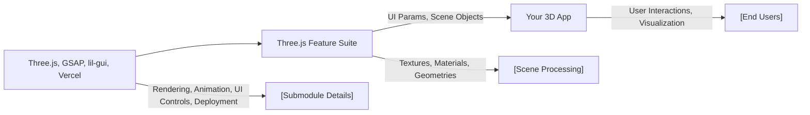

# API Overview

## Overview
This repository is a feature-centric collection of modular packages designed to provide a comprehensive toolkit for building 3D experiences using Three.js. Each package addresses specific features such as 3D text rendering, animation integration, camera control, UI debugging, fullscreen behavior, geometry generation, deployment support, lighting setup, material management, texture handling, and object transformations. The modules are orchestrated to maximize interoperability while letting developers pick and compose features as needed in their Three.js-based projects.

## Key Features

- **3D Text Rendering**: Enables rendering and customization of 3D text within Three.js scenes, including font and layout adjustments.
- **Animation Controls**: Integrates GSAP for robust animation timelines and effects directly on 3D objects and camera movement.
- **Camera Management**: Supplies mechanisms for configuring and switching between various camera types and perspectives for user navigation.
- **Debug User Interface (UI)**: Adds a developer-control panel (via lil-gui) for inspecting and tweaking scene parameters in real time.
- **Fullscreen and Resizing**: Ensures seamless fullscreen transitions for immersive experiences and adapts the viewport on window resize events.
- **Geometry Utilities**: Provides a suite of common and advanced geometries to quickly assemble 3D scenes.
- **Deployment Support ("GoLive")**: Integrates streamlined deployment workflows (e.g., via Vercel) for pushing 3D projects live efficiently.
- **Lighting Controls**: Offers a variety of lighting types and configurations to establish realistic or custom illumination setups.
- **Material System**: Manages and creates customizable materials for enriching the surface qualities of meshes.
- **Texture Management**: Simplifies texture loading, mapping, and transformations for assets within the scene.
- **Transformations**: Supplies concise APIs to move, scale, and rotate 3D objects, supporting interactivity and animation workflows.

## System Errors

- **Dependency Load Failure**: Scenarios where a module cannot find required versions of Three.js, lil-gui, or GSAP.  
  _Resolution_: Ensure all dependencies are installed and compatible across packages. Run `npm install` or use a monorepo tool to synchronize versions.

- **Renderer/Context Errors**: Issues when initializing the canvas or 3D context, often triggered by fullscreen or resize modules.  
  _Resolution_: Check browser compatibility, confirm DOM container availability, and debug size handling logic or permissions.

- **UI/GUI Integration Errors**: Errors resulting from misconfigured or missing lil-gui integration in Debug UI or other packages.  
  _Resolution_: Verify lil-gui initialization order and inclusion in scene setup. Follow documented integration patterns.

## Usage Examples

```js
// 1. Import and initialize THREE.js core modules
import * as THREE from 'three';

// 2. Add 3D Text (requires 3DText package and lil-gui for UI)
import { create3DText } from '3DText';
const scene = new THREE.Scene();
const textMesh = create3DText({ text: 'Hello World', fontSize: 2 });
scene.add(textMesh);

// 3. Setup Animation (requires Animation package and gsap)
import { setupAnimations } from 'Animation';
setupAnimations(textMesh);

// 4. Configure Camera (from Camera package)
import { createCamera } from 'Camera';
const camera = createCamera({ type: 'perspective', fov: 75 });
scene.add(camera);

// 5. Enable Fullscreen and Resize Handling
import { enableFullscreen, handleResize } from 'FullScreen Resize';
enableFullscreen();
window.addEventListener('resize', handleResize);

// 6. Debug UI (requires Debug UI package and lil-gui)
import { initDebugUI } from 'Debug UI';
initDebugUI(scene);

// 7. Lights and Materials
import { addLights } from 'Lights';
import { createMaterial } from 'Materials';
addLights(scene);
const mesh = new THREE.Mesh(
  new THREE.BoxGeometry(),
  createMaterial({ color: 0xff0000 })
);
scene.add(mesh);

// 8. Geometry, Textures, Transforms
// ... Add as needed from corresponding packages

// 9. Deploying project (GoLive module)
// Run in CLI: npm run deploy
```

## System Integration


