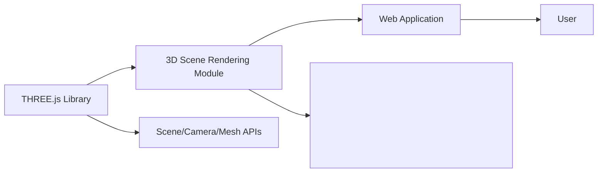

# 3D Scene Rendering Module

## Overview
This module provides a basic 3D scene rendering setup using the THREE.js library. It initializes a scene with a simple red cube, a perspective camera, and a WebGL renderer. The module's primary purpose is to facilitate 3D graphics rendering within a web application, serving as a foundation for further interactive or complex 3D visualizations.

## Key Features
- **Scene Initialization**: Sets up a THREE.js scene, which acts as a container for all 3D objects, cameras, and lights.
- **Mesh Creation**: Generates a 3D cube mesh with configurable geometry and material, demonstrating object integration into the scene.
- **Perspective Camera Setup**: Establishes a perspective camera for a realistic 3D viewing experience, with customizable field of view and aspect ratio.
- **WebGL Renderer Integration**: Connects the rendering pipeline to a specified HTML canvas element, enabling hardware-accelerated drawing of the scene.
- **Configurable Output Size**: Allows setting a fixed output size for the renderer, ensuring consistent display dimensions.

## System Errors
- **Canvas Not Found**: If the `<canvas class="webgl">` element does not exist in the HTML, the renderer will not function.  
  _Resolution_: Ensure your HTML has `<canvas class="webgl"></canvas>`.
- **WebGL Not Supported**: If the browser does not support WebGL, THREE.WebGLRenderer may fail to initialize.  
  _Resolution_: Check browser compatibility and consider a fallback or user warning.

## Usage Examples

```javascript
// Ensure you have a <canvas class="webgl"></canvas> in your HTML

import * as THREE from 'three';

// Select canvas
const canvas = document.querySelector('canvas.webgl');

// Create scene
const scene = new THREE.Scene();

// Add a red cube
const geometry = new THREE.BoxGeometry(1, 1, 1);
const material = new THREE.MeshBasicMaterial({ color: 0xff0000 });
const mesh = new THREE.Mesh(geometry, material);
scene.add(mesh);

// Set sizes
const sizes = { width: 800, height: 600 };

// Set up camera
const camera = new THREE.PerspectiveCamera(75, sizes.width / sizes.height);
camera.position.z = 3;
scene.add(camera);

// Instantiate renderer
const renderer = new THREE.WebGLRenderer({ canvas });
renderer.setSize(sizes.width, sizes.height);

// Render the scene
renderer.render(scene, camera);
```

## System Integration


