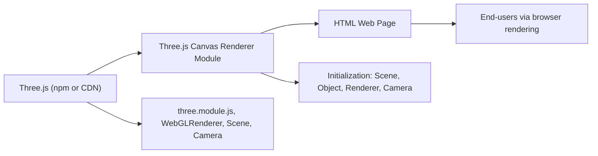

# Three.js Canvas Renderer Module

## Overview
This module initializes a basic 3D scene in the browser using Three.js. It sets up a canvas, scene, camera, renderer, and a simple 3D object (a red cube), serving as a foundational entry point for 3D web applications. It demonstrates the core pipeline for rendering interactive 3D graphics directly in a webpage.

## Key Features
- **Canvas Integration**: Connects a Three.js WebGL renderer to an HTML `<canvas>` element, enabling direct 3D rendering in the browser.
- **Scene Initialization**: Sets up a Three.js scene including camera, lighting (if extended), and objects.
- **3D Object Rendering**: Renders a basic 3D object (cube) as a starting point for more complex scenes.
- **Configurable Viewport**: Defines and adapts the canvas size for predictable display across devices.
- **Basic Camera Setup**: Incorporates a perspective camera positioned for a clear view of the scene.
- **Single-frame Render Loop**: Renders the scene from the camera’s perspective to the canvas.

## System Errors
- **Canvas Not Found**:  
  *Description*: If the canvas element with class `.webgl` is missing from the HTML, the renderer cannot initialize, leading to a runtime error.  
  *Resolution*: Ensure `<canvas class="webgl"></canvas>` exists in your HTML before running the script.

- **Three.js Module Not Found**:  
  *Description*: If Three.js is not installed or imported correctly, the script will fail to import required classes.  
  *Resolution*: Install Three.js via npm or ensure it is available in your dependencies.

## Usage Examples

```js
// In your HTML file:
// <canvas class="webgl"></canvas>

// In your JavaScript module:
import * as THREE from 'three'

// Get the WebGL canvas
const canvas = document.querySelector('canvas.webgl')

// Create the scene
const scene = new THREE.Scene()

// Add a cube
const geometry = new THREE.BoxGeometry(1, 1, 1)
const material = new THREE.MeshBasicMaterial({ color: 0xff0000 })
const mesh = new THREE.Mesh(geometry, material)
scene.add(mesh)

// Define display size
const sizes = { width: 800, height: 600 }

// Setup camera
const camera = new THREE.PerspectiveCamera(75, sizes.width / sizes.height)
camera.position.z = 3
scene.add(camera)

// Setup renderer and render the scene
const renderer = new THREE.WebGLRenderer({ canvas: canvas })
renderer.setSize(sizes.width, sizes.height)
renderer.render(scene, camera)
```

## System Integration

