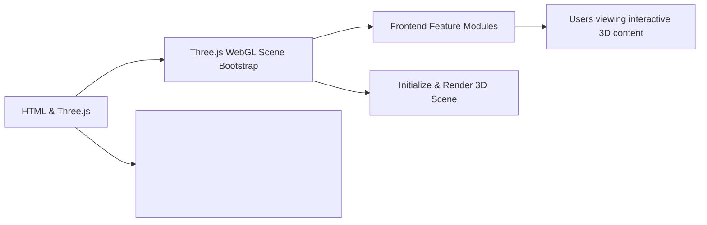

# Three.js WebGL Scene Bootstrap

## Overview
This module initializes and renders a basic 3D scene using [Three.js](https://threejs.org/) within a web application context. It sets up the essential components—scene, camera, 3D object, and WebGL renderer—allowing other system modules or developers to quickly display interactive 3D graphics on an HTML canvas. It is a foundational integration point for any frontend project that aims to introduce advanced 3D visualizations or simulations.

## Key Features

- **Three.js Scene Initialization**: Establishes a 3D scene as the root container for all graphical objects.
- **Canvas Integration**: Binds rendering output seamlessly to a user-supplied `<canvas>` DOM element.
- **Basic Object Rendering**: Demonstrates 3D rendering by creating, adding, and visualizing a colored geometric mesh (cube).
- **Adjustable Camera Projection**: Sets up a perspective camera placed relative to the scene; ready for navigation or view adjustments.
- **WebGL Renderer Setup**: Initializes Three.js's WebGLRenderer targeting the specified canvas with configurable resolution.

## System Errors

- **Canvas Not Found**:  
  *Description*: The module queries for `<canvas class="webgl">` in the DOM. If missing, Three.js renderer may fail or log errors.  
  *Resolution*: Ensure your HTML contains `<canvas class="webgl"></canvas>` before the script runs.

- **WebGL Context Initialization Failure**:  
  *Description*: WebGLRenderer may fail if the browser/device does not support WebGL.  
  *Resolution*: Use Three.js capability checks (`WebGL.isWebGLAvailable()`) and provide fallbacks or user guidance if unavailable.

- **Scene Appears Blank**:  
  *Description*: Errors in camera configuration, object visibility, or incorrect renderer sizing may cause a blank canvas.  
  *Resolution*: Verify camera setup, mesh positions, and that canvas size matches desired resolution.

## Usage Examples

```js
// HTML
// <canvas class="webgl"></canvas>

// JavaScript
import * as THREE from 'three'

// Get canvas element
const canvas = document.querySelector('canvas.webgl')

// Create scene
const scene = new THREE.Scene()

// Add a red cube
const geometry = new THREE.BoxGeometry(1, 1, 1)
const material = new THREE.MeshBasicMaterial({ color: 0xff0000 })
const mesh = new THREE.Mesh(geometry, material)
scene.add(mesh)

// Set sizes
const sizes = { width: 800, height: 600 }

// Setup camera
const camera = new THREE.PerspectiveCamera(75, sizes.width / sizes.height)
camera.position.z = 3
scene.add(camera)

// Setup renderer
const renderer = new THREE.WebGLRenderer({ canvas: canvas })
renderer.setSize(sizes.width, sizes.height)
renderer.render(scene, camera)
```

## System Integration


