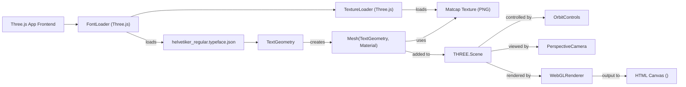

# 3D Text and Fonts Integration

## Overview
The 3D Text and Fonts module enables rendering of dynamic, interactive 3D text objects within a Three.js scene by loading and leveraging custom font files. This feature is essential for projects requiring rich textual presentation in a 3D context, such as titles, labels, or UIs within WebGL-based applications.

## Key Features

- **3D Text Geometry Creation**: Dynamically creates 3D mesh objects from textual strings using `TextGeometry`, supporting customized size, height, bevel, and curve options. Enables rich visual text elements that integrate seamlessly into 3D scenes.
- **Font Loader Integration**: Loads external font files in JSON format (e.g., Helvetiker) via Three.js's `FontLoader`, enabling the use of custom or branded typefaces for 3D text creation.
- **Texture and Material Application**: Supports applying `MeshMatcapMaterial` or other materials to text meshes, allowing realistic or stylized appearances with matcaps or custom textures.
- **Instancing & Decorative Repetition**: Demonstrates creation of multiple decorative mesh objects (e.g., donuts) using shared materials and random transforms alongside text, improving the visual richness and variety of the scene.
- **Live Scene and Camera Controls**: Integrates with `OrbitControls` to support interactive camera navigation around 3D text. Ensures the text and accompanying objects remain responsive to user input and resizing events.

## System Errors

- **Font Loading Error**: 
  - **Description**: Font file (`helvetiker_regular.typeface.json`) fails to load or is not found at the specified URL.
  - **Resolution**: Ensure the font file exists at the specified path (`/fonts/helvetiker_regular.typeface.json`). Verify web server configuration allows access to the file. Relative paths should be valid from the perspective of the served HTML.
- **Texture Loading Error**:
  - **Description**: Matcap texture or other textures used in materials fail to load, resulting in rendering of objects without textures or with errors.
  - **Resolution**: Confirm the texture file exists at the specified location (`/textures/matcaps/1.png`). Check for typos and confirm static asset serving is correctly configured.
- **Renderer or Canvas Attachment Failure**: 
  - **Description**: The WebGL renderer cannot attach to the specified canvas, possibly due to a missing or misnamed HTML element.
  - **Resolution**: Ensure there is a `<canvas class="webgl"></canvas>` element in the HTML and that the script is loaded after the DOM is ready.

## Usage Examples

```js
// Import required Three.js components
import * as THREE from 'three'
import { FontLoader } from 'three/examples/jsm/loaders/FontLoader.js'
import { TextGeometry } from 'three/examples/jsm/geometries/TextGeometry.js'

const fontLoader = new FontLoader()
const scene = new THREE.Scene()

// Load a font and create 3D text
fontLoader.load('/fonts/helvetiker_regular.typeface.json', (font) => {
    const textGeometry = new TextGeometry('Hello Three.js', {
        font: font,
        size: 0.5,
        height: 0.2,
        curveSegments: 5,
        bevelEnabled: true,
        bevelThickness: 0.03,
        bevelSize: 0.02,
        bevelOffset: 0,
        bevelSegments: 4
    })
    textGeometry.center()

    const matcapTexture = new THREE.TextureLoader().load('/textures/matcaps/1.png')
    matcapTexture.colorSpace = THREE.SRGBColorSpace
    const material = new THREE.MeshMatcapMaterial({ matcap: matcapTexture })
    
    const textMesh = new THREE.Mesh(textGeometry, material)
    scene.add(textMesh)
})
```

## System Integration


**Legend**:  
- **Dependencies**: FontLoader, TextureLoader  
- **This Module**: TextGeometry/TextMesh creation logic  
- **Used By**: Scene, Renderer, Camera Controls, Application Frontend  

The font file in `/fonts/helvetiker_regular.typeface.json` is a critical asset enabling the TextGeometry computations. The same font data is referenced by both 3DText and GoLive modules, ensuring branding consistency or reuse across multiple app contexts. The module also demonstrates best practices for modular 3D text asset management in Three.js-based projects.