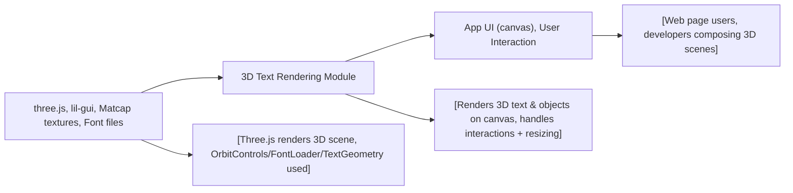

# 3D Text Rendering Module (Three.js)

## Overview
The 3D Text Rendering Module enables dynamic creation and interactive visualization of 3D text elements using the Three.js library. It is designed to render styled 3D text on the web, complete with texture mapping and advanced geometry, and complements scenes with animated controls and floating objects. The module is typically used as a demo or foundation for interactive 3D graphics applications involving custom text.

## Key Features

- **3D Text Generation**: Loads font files and generates 3D text meshes with customizable geometry attributes (size, bevel, curve segments, etc.).
- **Matcap Texture Support**: Applies matcap textures to text and 3D objects, giving an advanced, shader-driven material effect right out-of-the-box.
- **Scene Composition**: Places the 3D text in a configurable scene, alongside an array of randomly generated 3D donuts for environmental effect.
- **Interactive Camera Controls**: Integrates orbit controls, allowing users to interactively rotate, zoom, and pan around the text with smooth damping.
- **Live Resize Handling**: Adapts the viewport and camera parameters automatically whenever the browser window is resized.
- **Rendering Loop**: Establishes an efficient render loop for continuous animation, ensuring smooth interactivity and real-time updates.
- **GUI Integration**: Bundles a debugging GUI for real-time numeric adjustments of scene parameters (extension point for further development).

## System Errors

- **Resource Load Error**: If font or texture files are inaccessible or missing from the configured paths (`/fonts/helvetiker_regular.typeface.json`, `/textures/matcaps/1.png`), 3D text is not rendered.
  - **Resolution**: Ensure all required font and texture resources exist in the specified directories and are correctly referenced.

- **Canvas/Context Not Found**: If the `<canvas class="webgl">` element is missing from the HTML, rendering will silently fail.
  - **Resolution**: Verify that the HTML body contains `<canvas class="webgl"></canvas>` and the script is loaded after or in defer mode.

- **WebGL Not Supported**: On browsers without WebGL support, the rendering context cannot be created.
  - **Resolution**: Advise end-users to upgrade to a modern browser with WebGL support.

## Usage Examples

```js
// Assuming index.html includes: <canvas class="webgl"></canvas>
import * as THREE from 'three'
import { FontLoader } from 'three/examples/jsm/loaders/FontLoader.js'
import { TextGeometry } from 'three/examples/jsm/geometries/TextGeometry.js'

// Set up texture, font loader, and scene
const textureLoader = new THREE.TextureLoader()
const matcapTexture = textureLoader.load('/textures/matcaps/1.png')
const fontLoader = new FontLoader()
const scene = new THREE.Scene()

fontLoader.load('/fonts/helvetiker_regular.typeface.json', font => {
  const textGeometry = new TextGeometry('Hello Three.js', {
    font: font, size: 0.5, height: 0.2, bevelEnabled: true, bevelThickness: 0.03
  })
  textGeometry.center()
  const material = new THREE.MeshMatcapMaterial({ matcap: matcapTexture })
  const textMesh = new THREE.Mesh(textGeometry, material)
  scene.add(textMesh)
  // ...set up camera, renderer, controls as shown in script.js...
})
```

## System Integration


