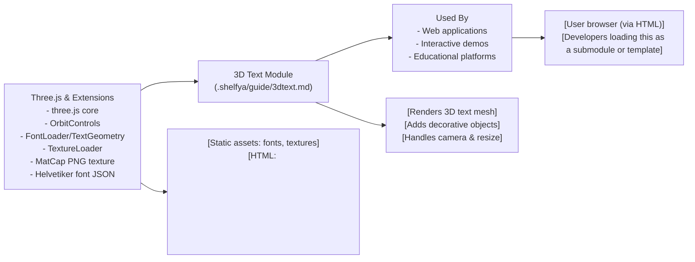

# 3D Text Module

## Overview
The 3D Text module enables the rendering and display of interactive 3D text in a web browser using Three.js. It creates visually striking 3D text mesh objects, complete with material and lighting effects, and supplements them with additional scene objects for richer demonstrations or experiences. This module is suited for applications that want to display customized 3D text with smooth camera controls, real-time resizing, and high-quality font rendering within a larger Three.js scene.

## Key Features
- **3D Text Rendering**: Loads a JSON typeface and generates customizable 3D text meshes with bevel, thickness, and segment settings.
- **Material and MatCap Support**: Applies MatCap materials for enhanced shading and realistic lighting on text and shapes.
- **Dynamic Scene Composition**: Automatically adds a set of randomly positioned donuts (torus meshes) to the scene for depth and visual interest.
- **Orbit Controls**: Enables interactive control of the camera around the 3D scene for end-user exploration.
- **Responsive Rendering**: Adjusts the renderer and camera when the browser window is resized to maintain aspect ratio and visual fidelity.
- **Font Loader Integration**: Utilizes Three.js' FontLoader for asynchronous typeface loading.

## System Errors
- **Font Not Loading**: If the JSON font file does not load, 3D text will not appear in the scene.
  - **Resolution**: Ensure the font path is correct and the font file is included in the `/fonts/` static directory. Confirm server supports JSON file serving.
- **Texture Not Loading**: If the MatCap texture fails to load, text and objects may render incorrectly or appear flat.
  - **Resolution**: Check that `/textures/matcaps/1.png` is present and accessible; adjust path if the directory structure is different.
- **Canvas Not Found**: If no `<canvas class="webgl">` is present in the HTML, nothing will render.
  - **Resolution**: Ensure your HTML includes `<canvas class="webgl"></canvas>`.
- **Performance Issues**: Adding many meshes (e.g., 100 toruses) may cause slow performance on limited hardware.
  - **Resolution**: Lower the number of scene objects or optimize object complexity.

## Usage Examples

```js
// Assuming HTML has <canvas class="webgl"></canvas>
import * as THREE from 'three'
import { OrbitControls } from 'three/examples/jsm/controls/OrbitControls.js'
import { FontLoader } from 'three/examples/jsm/loaders/FontLoader.js'
import { TextGeometry } from 'three/examples/jsm/geometries/TextGeometry.js'

// Load MatCap texture and font, then add 3D text to the scene
const scene = new THREE.Scene();
const camera = new THREE.PerspectiveCamera(75, window.innerWidth/window.innerHeight, 0.1, 100);
camera.position.set(1, 1, 2);

const renderer = new THREE.WebGLRenderer({canvas: document.querySelector('.webgl')});
renderer.setSize(window.innerWidth, window.innerHeight);

const controls = new OrbitControls(camera, renderer.domElement);

const textureLoader = new THREE.TextureLoader();
const matcapTexture = textureLoader.load('/textures/matcaps/1.png', tex => {
  tex.colorSpace = THREE.SRGBColorSpace;
});

const fontLoader = new FontLoader();
fontLoader.load('/fonts/helvetiker_regular.typeface.json', font => {
  const textGeometry = new TextGeometry('Hello Three.js', {
    font: font,
    size: 0.5,
    height: 0.2,
    bevelEnabled: true,
    bevelThickness: 0.03,
    bevelSize: 0.02,
    bevelSegments: 4,
  });
  textGeometry.center();

  const material = new THREE.MeshMatcapMaterial({ matcap: matcapTexture });

  const textMesh = new THREE.Mesh(textGeometry, material);
  scene.add(textMesh);

  // Add decorative donuts
  const donutGeometry = new THREE.TorusGeometry(0.3, 0.2, 20, 45);
  for (let i = 0; i < 100; i++) {
    const donut = new THREE.Mesh(donutGeometry, material);
    donut.position.set(
      (Math.random() - 0.5) * 10,
      (Math.random() - 0.5) * 10,
      (Math.random() - 0.5) * 10
    );
    donut.rotation.x = Math.random() * Math.PI;
    donut.rotation.y = Math.random() * Math.PI;
    const scale = Math.random();
    donut.scale.set(scale, scale, scale);
    scene.add(donut);
  }
});

// Handle resize events
window.addEventListener('resize', () => {
  camera.aspect = window.innerWidth / window.innerHeight;
  camera.updateProjectionMatrix();
  renderer.setSize(window.innerWidth, window.innerHeight);
});

// Rendering loop
function animate() {
  controls.update();
  renderer.render(scene, camera);
  requestAnimationFrame(animate);
}
animate();
```

## System Integration


