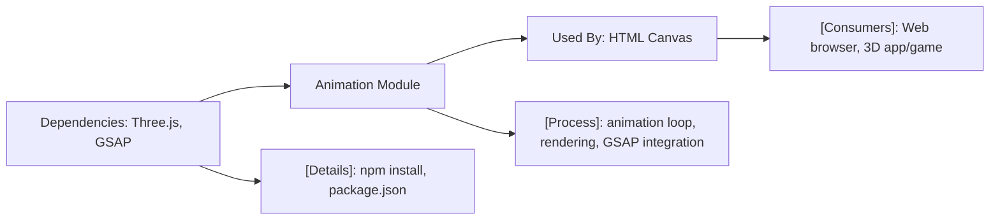

# Animation Module

## Overview
The Animation module enables interactive 3D object animations within a web browser using Three.js and GSAP. It provides a rendering loop to animate objects in real-time, making it easy to visualize and interact with 3D scenes. This module is central for building dynamic graphics or games and serves as an integration point for graphical rendering and animation workflows.

## Key Features
- **3D Scene Setup**: Initializes a Three.js scene with camera, renderer, and geometry. Prepares the context for all visual object manipulations.
- **Continuous Animation Loop**: Provides a built-in rendering loop that updates object positions using calculated elapsed time, ensuring smooth movement and animation.
- **Sinusoidal Motion Example**: The included sample animates a cube in a sinusoidal pattern, demonstrating how developers can create dynamic, real-time animations using elapsed time.
- **GSAP Integration**: Out-of-the-box support for GSAP, enabling advanced timeline and object property animations via simple APIs (sample commented for reference).
- **WebGL Canvas Integration**: Attaches rendering output to a canvas element, enabling seamless embedding into any HTML page.
- **Configurable Scene Dimensions**: Exposes a simple size configuration for scene width and height, matching various display requirements.

## System Errors
- **Missing Canvas Element**: If `<canvas class="webgl">` is not present in the HTML, scene rendering will fail.  
  *Resolution*: Ensure the HTML contains a canvas element with the correct class.
- **Three.js or GSAP Import Errors**: Module will not work if dependencies are not installed or correctly imported.  
  *Resolution*: Run `npm install` before starting the server; check package.json includes `three` and `gsap`.
- **Rendering Is Blank/Not Updating**: Occurs if animation loop (`tick()`) is interrupted or if requestAnimationFrame is not called.  
  *Resolution*: Verify that the animation loop is running and connected to the render method.

## Usage Examples

```javascript
// src/script.js

import * as THREE from 'three'
import gsap from 'gsap'

const canvas = document.querySelector('canvas.webgl')
const scene = new THREE.Scene()

const geometry = new THREE.BoxGeometry(1, 1, 1)
const material = new THREE.MeshBasicMaterial({ color: 0xff0000 })
const mesh = new THREE.Mesh(geometry, material)
scene.add(mesh)

const sizes = { width: 800, height: 600 }
const camera = new THREE.PerspectiveCamera(75, sizes.width / sizes.height)
camera.position.z = 3
scene.add(camera)

const renderer = new THREE.WebGLRenderer({ canvas: canvas })
renderer.setSize(sizes.width, sizes.height)

const clock = new THREE.Clock()

// Animate with GSAP (optional)
// gsap.to(mesh.position, { duration: 1, delay: 1, x: 2 })

const tick = () => {
    const elapsedTime = clock.getElapsedTime()
    mesh.position.y = Math.sin(elapsedTime)
    mesh.position.x = Math.cos(elapsedTime)
    renderer.render(scene, camera)
    window.requestAnimationFrame(tick)
}

tick()
```

**In HTML:**
```html
<canvas class="webgl"></canvas>
<script type="module" src="./script.js"></script>
```

## System Integration

