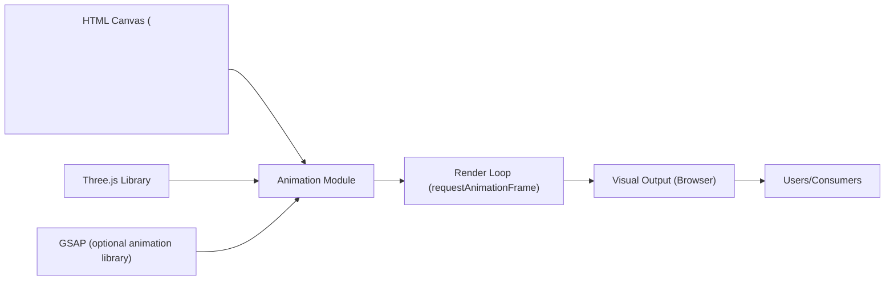

# Animation Module

## Overview
The Animation module provides a simple, interactive 3D animation experience using Three.js. It enables rendering and animating a 3D box within a browser canvas, demonstrating real-time animation and rendering techniques for browser-based 3D scenes. The module integrates core Three.js components and animation utilities, serving as an entry point for web-based 3D visualization.

## Key Features
- **3D Scene Rendering**: Renders a 3D scene containing a colored box (mesh) onto an HTML canvas using Three.js.
- **Camera Setup**: Sets up a perspective camera for intuitive scene visualization.
- **Real-Time Animation Loop**: Animates the mesh in real-time, making it move in a circular path within the scene using elapsed time.
- **Responsive Renderer**: Initializes and fits the renderer for the specified canvas dimensions.
- **GSAP Animation Integration Point**: (Commented-out code) Illustrates how GSAP can be integrated for advanced property-based animation, although not active in the example.

## System Errors
- **Canvas Not Found**: 
  - **Description**: If the HTML document does not have a `<canvas class="webgl">`, the module will fail to render, causing `canvas` to be `null` and leading to errors.
  - **Resolution**: Ensure the HTML file includes `<canvas class="webgl"></canvas>`.
- **WebGL Context Issues**: 
  - **Description**: If the browser does not support WebGL, initialization of the Three.js renderer will fail and rendering will not occur.
  - **Resolution**: Use a modern browser with WebGL enabled and updated graphics drivers.

## Usage Examples

```javascript
// HTML: Ensure your HTML includes a canvas element
// <canvas class="webgl"></canvas>

// JS: Import dependencies in your module-based project
import * as THREE from 'three'
// Optionally: import gsap from 'gsap'

// Scene Setup
const canvas = document.querySelector('canvas.webgl')
const scene = new THREE.Scene()

// Add a red box mesh
const geometry = new THREE.BoxGeometry(1, 1, 1)
const material = new THREE.MeshBasicMaterial({ color: 0xff0000 })
const mesh = new THREE.Mesh(geometry, material)
scene.add(mesh)

// Set up camera
const sizes = { width: 800, height: 600 }
const camera = new THREE.PerspectiveCamera(75, sizes.width / sizes.height)
camera.position.z = 3
scene.add(camera)

// Set up renderer
const renderer = new THREE.WebGLRenderer({ canvas: canvas })
renderer.setSize(sizes.width, sizes.height)

// Animation loop: Animate the mesh in a circular path
const clock = new THREE.Clock()
const tick = () => {
    const elapsedTime = clock.getElapsedTime()
    mesh.position.y = Math.sin(elapsedTime)
    mesh.position.x = Math.cos(elapsedTime)
    renderer.render(scene, camera)
    window.requestAnimationFrame(tick)
}
tick()
```

## System Integration


