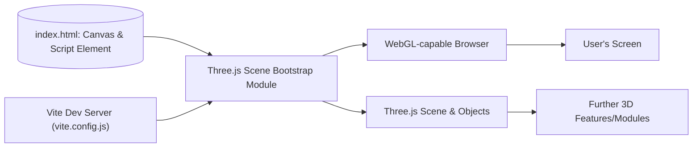

# Three.js Scene Bootstrap Architecture

## Overview
This module provides a foundational 3D scene setup using [Three.js](https://threejs.org/), suitable for web-based visualizations and rapid prototyping. It bootstraps a WebGL 3D environment, renders a basic object, and establishes the core building blocks—Canvas, Scene, Camera, and Renderer. The structure enables developers to quickly build, expand, or integrate more complex 3D features within modern frontend workflows powered by Vite.

## Key Features

- **WebGL Canvas Integration**: Initializes a dedicated HTML `<canvas>` and binds it to Three.js, offering a rendering surface for 3D content.
- **Scene Setup**: Establishes a new Three.js scene instance, serving as a container for 3D objects, lighting, and helpers.
- **Object Initialization**: Adds a basic 3D object—a red cube—demonstrating object management within the scene.
- **Camera Configuration**: Positions a perspective camera to provide a viewpoint for rendering, essential for 3D navigation and interaction.
- **Renderer Management**: Dynamically ties the Three.js renderer to the canvas, handles sizing, and triggers the initial render pass.
- **Vite Integration**: Optimized project structure for use with Vite, supporting fast local development, hot reloads, and custom build outputs.

## System Errors

- **Missing Canvas Element**:  
  *Description*: The canvas element with the class `webgl` is not found within the HTML document.  
  *Resolution*: Ensure `<canvas class="webgl"></canvas>` exists in your HTML file.

- **WebGL Context Loss / Renderer Failure**:  
  *Description*: The renderer cannot initialize (typically due to browser/WebGL support issues).  
  *Resolution*:  
    - Confirm browser compatibility with WebGL.  
    - Check browser console for security errors related to cross-origin or file serving.  
    - Ensure the `renderer` is constructed after DOMContentLoaded.

## Usage Examples

```js
// 1. Ensure your HTML contains:
<canvas class="webgl"></canvas>

// 2. Example: Basic Three.js Scene Creation (script.js)
import * as THREE from 'three'

// Select canvas
const canvas = document.querySelector('canvas.webgl')

// Create scene
const scene = new THREE.Scene()

// Create a red cube and add to scene
const geometry = new THREE.BoxGeometry(1, 1, 1)
const material = new THREE.MeshBasicMaterial({ color: 0xff0000 })
const mesh = new THREE.Mesh(geometry, material)
scene.add(mesh)

// Camera setup
const camera = new THREE.PerspectiveCamera(75, 800 / 600)
camera.position.z = 3
scene.add(camera)

// Renderer setup and first render
const renderer = new THREE.WebGLRenderer({ canvas })
renderer.setSize(800, 600)
renderer.render(scene, camera)
```

## System Integration



- **Dependencies**: HTML structure (`<canvas class="webgl">`), Three.js library, and the Vite dev/build system.
- **This Module**: Initializes the Three.js scene within the canvas, sets up the basic camera, scene, object, and renderer relationships.
- **Used By**: Any system or developer requiring a 3D rendering base for web projects; can be extended by further 3D graphics features or plugins.