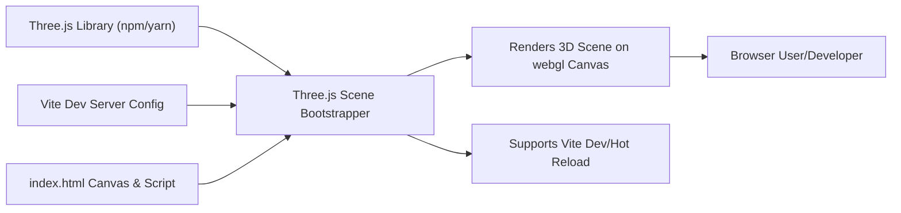

# Three.js Scene Bootstrapper

## Overview
This module bootstraps a basic 3D scene using Three.js. It sets up the essential rendering pipeline, including canvas creation, a rendering context, basic geometric objects, and a camera, allowing any web page to quickly display and experiment with 3D graphics. This serves as the entry point and foundation for more complex Three.js applications.

## Key Features

- **Canvas Initialization**: Selects and manages the `<canvas>` HTML element dedicated to 3D rendering.
- **Scene and Object Setup**: Creates a Three.js scene and adds a sample 3D box mesh to demonstrate rendering capabilities.
- **Camera Configuration**: Establishes a perspective camera positioned appropriately to view objects in the scene.
- **Renderer Initialization**: Sets up the WebGL renderer, attaches it to the selected canvas, and matches dimensional settings.
- **Single-Frame Rendering Pipeline**: Renders the current scene with the configured camera for immediate visualization.
- **Vite Integration**: Uses a Vite configuration optimized for rapid development and hot-reloading within the appropriate source/public directories.

## System Errors

- **Canvas Not Found**: If the `<canvas class="webgl">` element is missing from the HTML, the Three.js renderer will fail to initialize.  
  *Resolution:* Ensure `<canvas class="webgl"></canvas>` exists in the HTML body.

- **Three.js Import Failure**: If Three.js fails to import, rendering and scene assembly will not function.  
  *Resolution:* Validate that Three.js is correctly installed and accessible in your project dependencies.

- **WebGL Context Unavailable**: On browsers or devices without WebGL support, rendering will fail.  
  *Resolution:* Use feature detection and recommend running on up-to-date browsers with WebGL enabled.

- **Size Mismatch**: If the canvas CSS or JavaScript sizing is misaligned, rendering artefacts or improper scaling may occur.  
  *Resolution:* Ensure the renderer, canvas, and CSS settings agree on width and height.

## Usage Examples

```js
// Importing and running the module (script.js must be loaded as ES module in index.html)
import * as THREE from 'three'

// Obtain the canvas
const canvas = document.querySelector('canvas.webgl')

// Setup the Three.js scene
const scene = new THREE.Scene()

// Create a red cube mesh and add to the scene
const geometry = new THREE.BoxGeometry(1, 1, 1)
const material = new THREE.MeshBasicMaterial({ color: 0xff0000 })
const mesh = new THREE.Mesh(geometry, material)
scene.add(mesh)

// Define render sizing
const sizes = { width: 800, height: 600 }

// Configure the camera
const camera = new THREE.PerspectiveCamera(75, sizes.width / sizes.height)
camera.position.z = 3
scene.add(camera)

// Initialize renderer and output the scene
const renderer = new THREE.WebGLRenderer({ canvas: canvas })
renderer.setSize(sizes.width, sizes.height)
renderer.render(scene, camera)
```

## System Integration


