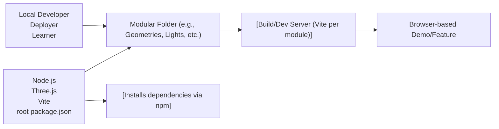

# Architecture Overview

## Overview
This project’s architecture is a modular collection of Three.js learning “exercises,” each organized in a separate folder. Each module (like 3D Text, Animation, Camera, etc.) is built and operated independently using Vite, but they share a common setup, deployment structure, and global dependencies (notably Three.js). The architecture enables developers to work on or deploy features in isolation, while maintaining a unified developer experience and build process.

## Key Features
- **Modular Feature Structure**: Each main Three.js lesson (e.g., Geometries, Materials, Lights) is self-contained in its own folder with its own source code, assets, and Vite configuration.
- **Standardized Build System**: Every module uses Vite for local development, optimized builds, and serving assets. Configurations are highly consistent across all modules.
- **Shared Public Directory**: Assets are served from a root-level `static/` directory to ensure resources are consistently available across modules.
- **Unified Dependency Management**: A single root `package.json` manages dependencies (notably Three.js and Vite), ensuring all modules use the same library versions and can share a node_modules folder.
- **Consistent Developer Workflow**: Common NPM scripts (`npm run dev`, `npm run build`) provide a predictable lifecycle for starting, building, and serving each module.
- **Isolated Output**: All build artifacts are output into individual `dist/` folders per module, to avoid conflicts and allow direct deployment/testing of any feature.

## System Errors
- **Port In Use Error**: Trying to run multiple modules (`npm run dev`) at the same time may cause port conflicts (default is 8080).
  - **Resolution**: Only run one dev server at a time, or specify a different port in the Vite config.
- **Shared Static Asset Conflicts**: Modifying or overwriting files in the global `static/` directory can cause unexpected behavior across modules.
  - **Resolution**: Use unique filenames and coordinate changes to shared assets.
- **Dependency Version Mismatch**: If a module requires a version of Three.js or Vite not matching `package.json`, builds or runtime may fail.
  - **Resolution**: Always install/update dependencies at the root with `npm install` to maintain consistency.

## Usage Examples

```bash
# Install dependencies for all modules
npm install

# Start developing in the "Geometries" module
cd Geometries
npm run dev

# Build the "Lights" module for production
cd ../Lights
npm run build

# Serve a built module (after build, using a simple static server)
npx serve dist
```

## System Integration



This modular architecture enables developers to learn, test, and deploy Three.js features in an isolated, maintainable, and reproducible manner, while sharing core tooling across all modules.