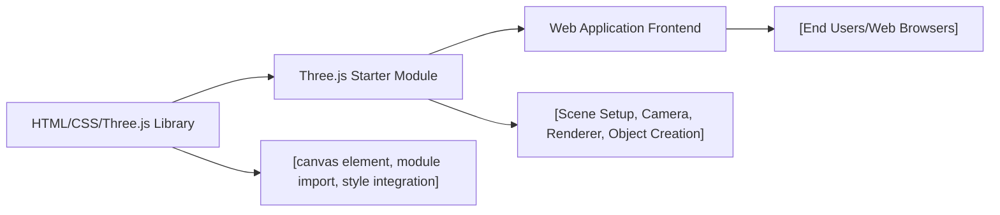

# Three.js Starter Architecture

## Overview
This module sets up a basic 3D rendering environment using Three.js within a web page. It provides the foundational integration required to display 3D scenes on a canvas, acting as the entry point for Three.js-powered experiences. The module’s purpose is to initialize a scene, camera, renderer, and a simple 3D object, allowing developers to build upon this structure for further 3D interactions and visualizations.

## Key Features
- **Canvas Integration**: Binds Three.js rendering to an HTML canvas element, enabling 3D graphics within the web page.
- **Scene Initialization**: Creates and configures a Three.js scene, forming the basis for all 3D content.
- **Camera Setup**: Establishes a perspective camera to view objects in the scene, controlling the user's visual perspective.
- **Renderer Configuration**: Instantiates the WebGL renderer, connects it to the canvas, and manages the rendering process.
- **Object Creation**: Constructs a simple 3D mesh (a red cube) as a starting example, demonstrating object instantiation and scene composition.

## System Errors
- **Canvas Not Found**: If the target canvas element with the class `.webgl` is missing from the HTML, rendering will not work.
  - **Resolution**: Ensure `<canvas class="webgl"></canvas>` is present in your HTML body.
- **WebGL Context Issues**: Browser or device does not support WebGL, resulting in rendering failures.
  - **Resolution**: Use a modern browser and ensure that hardware acceleration is enabled.
- **Incorrect Canvas Dimensions**: Visual artifacts or incorrect rendering sizes may appear if the renderer's size does not match the canvas/viewport.
  - **Resolution**: Adjust the `renderer.setSize()` parameters to match your desired display dimensions.

## Usage Examples

```js
// HTML: index.html snippet
<canvas class="webgl"></canvas>

// JavaScript: script.js simplified workflow
import * as THREE from 'three'
const canvas = document.querySelector('canvas.webgl')
const scene = new THREE.Scene()

// Create a red cube
const geometry = new THREE.BoxGeometry(1, 1, 1)
const material = new THREE.MeshBasicMaterial({ color: 0xff0000 })
const mesh = new THREE.Mesh(geometry, material)
scene.add(mesh)

// Set up camera
const camera = new THREE.PerspectiveCamera(75, 800 / 600)
camera.position.z = 3
scene.add(camera)

// Initialize renderer and display scene
const renderer = new THREE.WebGLRenderer({ canvas: canvas })
renderer.setSize(800, 600)
renderer.render(scene, camera)
```

## System Integration


