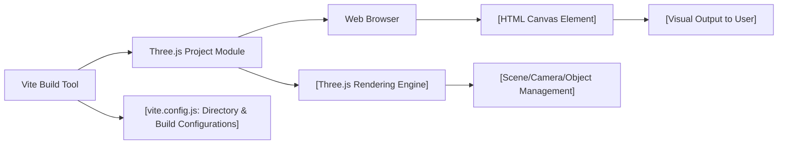

# Three.js Project Architecture

## Overview
This module provides the foundational architecture for a simple Three.js web application using Vite as the build tool. The system renders a 3D object (a red cube) onto an HTML canvas by leveraging Three.js for rendering, scene and camera setup, and Vite for modern frontend tooling, development experience, and optimized builds. Its primary role is to facilitate quick prototyping and learning with a clear separation of HTML, JavaScript, and project structure.

## Key Features

- **Three.js 3D Rendering**: Renders a basic 3D scene (red cube) onto a HTML canvas element.
- **Scene, Camera, and Object Management**: Sets up the essential Three.js objects—scene, perspective camera, mesh geometry, material, and mesh object.
- **Customizable Canvas**: Uses a dedicated `<canvas class="webgl">` for all WebGL/Three.js drawing, allowing for easy styling or replacement.
- **Vite Integration**: Modern build pipeline with fast dev server, hot-module reloading, optimized builds, and directory management.
- **Configurable Output**: Build outputs and public assets are separated and configured for clarity, supporting both development and production workflows.

## System Errors

- **Canvas Not Found**:  
  *Description*: If the HTML canvas with class `.webgl` is missing or mistyped, Three.js will not be able to render the scene and errors may occur.  
  *Resolution*: Ensure `<canvas class="webgl"></canvas>` exists in the HTML. Check the class name matches what is queried in JavaScript.

- **Three.js Dependency Missing**:  
  *Description*: If Three.js is not installed or is missing from `node_modules`, imports will fail and the renderer will not initialize.  
  *Resolution*: Run `npm install` to ensure dependencies are present. Verify `three` is listed under `dependencies` in `package.json`.

- **Vite Server/Build Misconfiguration**:  
  *Description*: If directory mapping or build outputs are incorrect, project may not compile, serve, or build as expected.  
  *Resolution*: Ensure `vite.config.js` settings match the expected directory structure (`src/` as root, build output to `dist/`). Use scripts `npm run dev` and `npm run build` as primary entry points.

## Usage Examples

```js
// src/script.js

import * as THREE from 'three'

// Select the canvas element
const canvas = document.querySelector('canvas.webgl')

// Create a new Three.js scene
const scene = new THREE.Scene()

// Create a red cube and add to scene
const geometry = new THREE.BoxGeometry(1, 1, 1)
const material = new THREE.MeshBasicMaterial({ color: 0xff0000 })
const mesh = new THREE.Mesh(geometry, material)
scene.add(mesh)

// Configure camera
const camera = new THREE.PerspectiveCamera(75, 800 / 600)
camera.position.z = 3
scene.add(camera)

// Initialize renderer using the selected canvas
const renderer = new THREE.WebGLRenderer({ canvas: canvas })
renderer.setSize(800, 600)
renderer.render(scene, camera)
```

**To start the development server:**
```bash
npm install
npm run dev
```

**To build for production:**
```bash
npm run build
```

## System Integration



**Explanation**:
- The **Vite Build Tool** compiles the code based on settings in `vite.config.js`, outputs assets, and serves them during development and for production.
- The **Three.js Project Module** is the entry point (script.js) that manages the 3D scene setup and rendering.
- **Three.js Rendering Engine** handles all graphical rendering and interacts with the HTML canvas.
- The **Web Browser** interprets the HTML and JavaScript, presenting the visual output to the user using the canvas element.