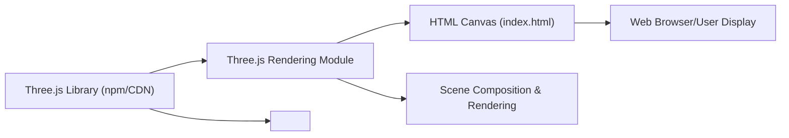

# Three.js Rendering Module

## Overview
The Three.js Rendering Module is responsible for initializing, composing, and displaying interactive 3D graphics within the browser. It creates a rendering context, sets up the scene with 3D objects, and renders them to the HTML canvas using the Three.js library. This module is fundamental for visualizing 3D models and handling all rendering processes in the application.

## Key Features
- **Scene Creation**: Initializes a Three.js scene, enabling the addition and management of 3D objects, lights, and cameras.
- **Canvas Integration**: Binds rendering output to an HTML canvas element, allowing 3D graphics to be displayed seamlessly on the web page.
- **Camera Setup**: Configures and positions a 3D perspective camera to determine the viewer’s point of view in the scene.
- **Mesh Rendering**: Constructs basic 3D geometry (e.g., a cube) with customizable materials and adds them to the scene for rendering.
- **One-Time Render**: Renders the scene from the camera’s point of view to the canvas without animation, suitable for static previews or simple scenes.
- **Responsive Configuration**: Enables straightforward adjustment of scene and camera size through a dedicated configuration object.

## System Errors
- **Canvas Not Found**: If the canvas with the expected CSS class is missing in the HTML, rendering will silently fail or throw a `TypeError`.  
  *Resolution*: Ensure your HTML includes `<canvas class="webgl"></canvas>` before initializing the Three.js code.
- **Three.js Import Failure**: If the Three.js library is not properly installed or cannot be imported, importing will throw a module error.  
  *Resolution*: Confirm that Three.js is listed as a dependency and installed (e.g., via npm or included via CDN).
- **Renderer Configuration Mismatch**: If the canvas size set in the renderer does not match the actual canvas or viewport, rendering may be misaligned or appear distorted.  
  *Resolution*: Adjust the `sizes.width` and `sizes.height` configuration to match the intended display area.

## Usage Examples

```js
import * as THREE from 'three'

// Select existing HTML canvas
const canvas = document.querySelector('canvas.webgl')

// Create new Three.js scene
const scene = new THREE.Scene()

// Add a red cube mesh
const geometry = new THREE.BoxGeometry(1, 1, 1)
const material = new THREE.MeshBasicMaterial({ color: 0xff0000 })
const mesh = new THREE.Mesh(geometry, material)
scene.add(mesh)

// Define rendering size
const sizes = { width: 800, height: 600 }

// Setup camera
const camera = new THREE.PerspectiveCamera(75, sizes.width / sizes.height)
camera.position.z = 3
scene.add(camera)

// Create renderer and render scene
const renderer = new THREE.WebGLRenderer({ canvas: canvas })
renderer.setSize(sizes.width, sizes.height)
renderer.render(scene, camera)
```

## System Integration


