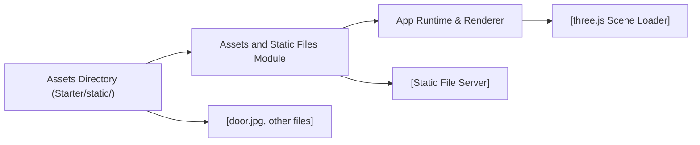

# Assets and Static Files

## Overview
This module manages the handling and serving of static assets (such as images, textures, and other files) required by the application built with three.js. Its main purpose is to ensure that these static resources are accessible to both the application at runtime and to users or systems integrating with it.

## Key Features
- **Static File Serving**: Allows the application to serve non-dynamic files (such as images and textures) that are required for rendering 3D scenes or UI elements.
- **Organized Asset Structure**: Provides a structured location (`Starter/static/`) where developers and designers can add or manage files like images (e.g., `door.jpg`) needed by the application.
- **Integration with Build and Deployment Tools**: Ensures that static assets are available during both development and in production, and that they are included in the build output by default.

## System Errors
It's important to document common errors and troubleshooting:

- **Missing Asset Error**: When code references an asset (e.g., an image) that is not present in the `static/` directory, the application may fail to display the asset (e.g., a missing texture in three.js), resulting in 404 responses or visual placeholders.
  - **Resolution**: Verify the asset's filename, location, and ensure it is correctly placed in the `Starter/static/` directory.
- **Deployment Asset Path Error**: In production, assets may not load if the deployment configuration does not correctly include or map the `static/` directory.
  - **Resolution**: Make sure the deployment or build system is configured to copy the contents of `static/` to the root or expected public path in the deployed environment.

## Usage Examples
Practical code examples showing how to use assets in the application:

```javascript
// Example: Using a static image as a texture in three.js

const textureLoader = new THREE.TextureLoader();
const texture = textureLoader.load('/static/door.jpg', () => {
    // Texture is loaded and can now be used on a material
    const material = new THREE.MeshBasicMaterial({ map: texture });
    // apply material to mesh...
});
```

Accessing an asset via a browser (helps validate paths):

```
http://localhost:3000/static/door.jpg
```

## System Integration



**Legend:**
- `Assets Directory`: Location for storing static files (e.g., images).
- `Assets Module`: Provides the feature for serving files.
- `App Runtime & Renderer`: Your application code and runtime, e.g., three.js code that loads resources.
- Integration ensures that assets referenced in your code (`/static/door.jpg`) map directly to the appropriate files served by your application. 

**Typical workflow:**
1. Add assets (e.g., images) to `Starter/static/`.
2. Reference those assets in your three.js code or HTML using the `/static/` path.
3. App's development server or production setup serves those files automatically.
4. At runtime, static files are loaded by external libraries or browser requests as needed.