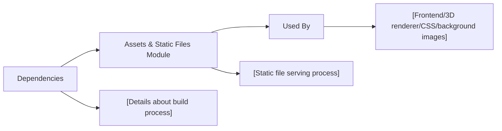

# Assets and Static Files

## Overview
This module manages assets and static files used within the system, providing a central location for images and other files required by the application. It enables developers to organize, serve, and reference media files such as images, textures, and other static resources that need to be accessible by the frontend or through public URLs. The static asset handling ensures that all necessary files are available without embedding them directly in code, keeping the codebase clean and maintainable.

## Key Features

- **Centralized Asset Storage**: Stores common files (e.g., images like `door.jpg`) in a dedicated `static/` directory within the project structure to be referenced across different parts of the application.
- **Public File Serving**: Ensures that all static files are automatically served with the application, allowing direct access via URLs without the need for additional configuration.
- **Reference by URL**: Allows assets to be easily referenced from application code (e.g., 3D models or textures in Three.js, background images in CSS) using predictable static URLs.
- **Decoupling of Code and Content**: Keeps static assets outside of application logic, facilitating easier asset updates or replacements without code changes.

## System Errors

- **File Not Found (404 Error)**: The requested static file does not exist within the `static/` directory.
  - **Resolution**: Confirm the correct filename and path. Ensure the required file has been added to the appropriate directory and committed to the repository.
- **Permission Denied**: The user or application process does not have permissions to read the static file.
  - **Resolution**: Check the file permissions and ownership in the `static/` directory, ensuring files are readable by the application server or static file handler.

## Usage Examples

```js
// Accessing a static asset in a web application
const img = document.createElement('img');
img.src = '/static/door.jpg'; // Assuming the app serves static files from '/static'
document.body.appendChild(img);

// Using an asset as a texture in Three.js
const textureLoader = new THREE.TextureLoader();
const texture = textureLoader.load('/static/door.jpg');
const material = new THREE.MeshBasicMaterial({ map: texture });
const mesh = new THREE.Mesh(geometry, material);
scene.add(mesh);
```

## System Integration



In summary, the Assets and Static Files module acts as the bridge between external resources and application code, enabling consistent and reliable access to non-code files needed by your project. It is foundational for managing media and resources that are required at runtime or presented in the UI, ensuring they are efficiently organized, accessible, and easily referenced.