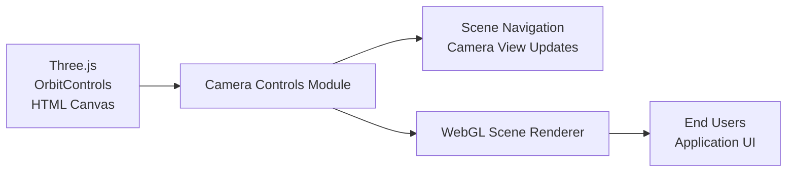

# Camera Controls

## Overview
The Camera Controls module provides an interactive 3D camera system for Three.js scenes. It enables users to explore and manipulate their view of the scene using intuitive input methods such as mouse movement or touch, leveraging the capabilities of OrbitControls. The module is central to delivering a smooth user experience in scenes where 3D navigation and inspection are required.

## Key Features
- **Interactive Orbit Controls**: Allows users to orbit, pan, and zoom around 3D objects using mouse or touch input. This enhances scene exploration and interactive visualization.
- **Camera Initialization**: Sets up a perspective camera, positioning and orienting it for optimal viewing of target objects.
- **Responsive Cursor-Based Camera Movement (Configurable)**: (Commented out in code, but included as a feature) Potential for direct camera manipulation based on pointer position, enabling further customization of user interactions.
- **Damping for Smooth Camera Motion**: Enables inertia effects, providing a more natural and responsive camera movement experience.
- **Seamless Scene Integration**: Integrates camera control into the Three.js animation/render loop, ensuring real-time response to user input and consistent scene updates.

## System Errors
- **Canvas Not Found**: If the target canvas (`canvas.webgl`) is missing, the camera controls and renderer will fail to initialize.  
  _Resolution_: Ensure your HTML contains a `<canvas class="webgl"></canvas>` element.

- **Renderer or Controls Instantiation Failure**: Missing or incompatible dependencies (such as `three` or `three/examples/jsm/controls/OrbitControls.js`) can cause errors when creating controls or the renderer.
  _Resolution_: Ensure all Three.js dependencies are correctly installed and imported.

## Usage Examples
Practical code examples showing how to use the module:
```javascript
import * as THREE from 'three';
import { OrbitControls } from 'three/addons/controls/OrbitControls.js';

// Get canvas element
const canvas = document.querySelector('canvas.webgl');
const sizes = { width: 800, height: 600 };

// Create scene and object
const scene = new THREE.Scene();
const mesh = new THREE.Mesh(
  new THREE.BoxGeometry(1, 1, 1, 5, 5, 5),
  new THREE.MeshBasicMaterial({ color: 0xff0000 })
);
scene.add(mesh);

// Initialize camera
const camera = new THREE.PerspectiveCamera(75, sizes.width / sizes.height);
camera.position.z = 2;
camera.lookAt(mesh.position);
scene.add(camera);

// Add orbit controls
const controls = new OrbitControls(camera, canvas);
controls.enableDamping = true;

// Renderer setup
const renderer = new THREE.WebGLRenderer({ canvas });
renderer.setSize(sizes.width, sizes.height);

// Animation loop
const clock = new THREE.Clock();
function animate() {
  controls.update(); // Smooth camera motion
  renderer.render(scene, camera);
  requestAnimationFrame(animate);
}
animate();
```

## System Integration
