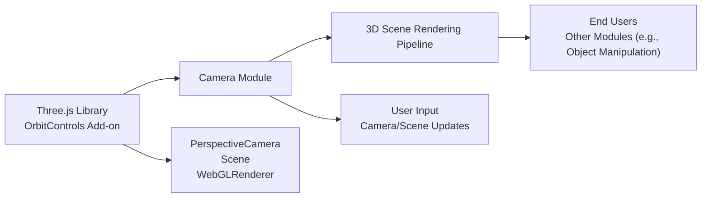

# Camera Module

## Overview
The Camera module provides fundamental 3D camera functionality within a Three.js-powered scene. It sets up and manages cameras, their controls, and user interactions to enable seamless navigation and visualization of 3D content. The module is central to rendering scenes, as it defines the point of view and interaction mechanisms for end users.

## Key Features
- **3D Camera Initialization**: Instantiates a PerspectiveCamera for rendering 3D scenes, with built-in support for changing the camera type if needed.
- **User Interaction via OrbitControls**: Allows users to rotate, zoom, and pan around the scene interactively using mouse or touch input.
- **Cursor Tracking for Dynamic Camera**: Tracks mouse cursor movement, enabling additional camera manipulation or interactivity based on user input (configurable in code).
- **Scene Integration**: Attaches the camera to a central Three.js scene, ensuring all renderings originate from the defined viewpoint.
- **Responsive Rendering**: Configures the renderer to use appropriate viewport dimensions and updates on each animation frame for smooth visuals.

## System Errors
- **Canvas Not Found**: 
  - *Description*: The module expects a `<canvas class="webgl">` element in the DOM. If missing, rendering and controls initialization will fail.
  - *Resolution*: Ensure the HTML includes `<canvas class="webgl"></canvas>` before loading the script.
- **Missing Three.js or OrbitControls**: 
  - *Description*: If Three.js or its OrbitControls add-on is not imported properly, camera setup and controls will not function.
  - *Resolution*: Confirm all Three.js dependencies are correctly installed and imported.
- **Incorrect Canvas Sizing**: 
  - *Description*: If the sizes object does not match the actual canvas size, rendering may appear distorted.
  - *Resolution*: Update the `sizes` object to reflect the real width and height or make it dynamic based on window size.

## Usage Examples
Practical code showing integration with Three.js and HTML canvas:

```js
import * as THREE from 'three'
import { OrbitControls } from 'three/addons/controls/OrbitControls.js'

// Set up sizes
const sizes = { width: 800, height: 600 }

// Create scene, camera, and renderer
const scene = new THREE.Scene()
const camera = new THREE.PerspectiveCamera(75, sizes.width / sizes.height)
camera.position.z = 2
scene.add(camera)

const renderer = new THREE.WebGLRenderer({
    canvas: document.querySelector('canvas.webgl')
})
renderer.setSize(sizes.width, sizes.height)

// Add orbit controls for interaction
const controls = new OrbitControls(camera, renderer.domElement)
controls.enableDamping = true

// Render loop
function animate() {
    controls.update() // for smooth controls
    renderer.render(scene, camera)
    requestAnimationFrame(animate)
}

animate()
```

## System Integration

