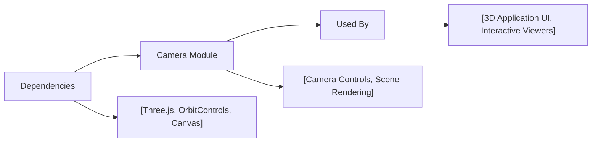

# Camera Module

## Overview
The Camera module provides interactive camera management for Three.js 3D scenes. It enables users to view, navigate, and manipulate perspectives within rendered environments, a crucial part of any 3D application. The module also integrates user input (mouse movements) to facilitate dynamic scene exploration using orbit controls.

## Key Features
- **Perspective Camera Rendering**: Sets up and manages a Three.js perspective camera, enabling 3D scene visualization with user-controllable viewpoint.
- **Orbit Controls Integration**: Allows users to navigate and orbit around scene objects using standard drag-and-pan mouse gestures.
- **Dynamic Canvas Sizing**: Configures the rendering canvas for consistent display and viewport sizing.
- **Real-Time Interaction**: Responds immediately to user mouse movements, updating the camera's view and scene rendering continuously.

## System Errors
- **Canvas Not Found**: If the target canvas (`.webgl`) is not present in the HTML, camera controls and rendering will not function.  
  *Resolution*: Ensure the HTML includes `<canvas class="webgl"></canvas>` before initializing the Camera module.
- **THREE or OrbitControls Import Error**: If Three.js or OrbitControls are improperly imported, runtime errors will occur.  
  *Resolution*: Verify package installation (`npm install three`) and proper import statements.
- **Invalid Canvas Size**: If the dimensions defined in `sizes` do not match the actual canvas size, rendering output may appear stretched or skewed.  
  *Resolution*: Adjust `sizes` to match desired viewport or make canvas responsive.

## Usage Examples
Practical code example showing camera setup and application of controls in a Three.js scene:

```javascript
import * as THREE from 'three'
import { OrbitControls } from 'three/addons/controls/OrbitControls.js'

// Canvas and sizes
const canvas = document.querySelector('canvas.webgl')
const sizes = { width: 800, height: 600 }

// Scene and mesh
const scene = new THREE.Scene()
const mesh = new THREE.Mesh(
  new THREE.BoxGeometry(1, 1, 1, 5, 5, 5),
  new THREE.MeshBasicMaterial({ color: 0xff0000 })
)
scene.add(mesh)

// Camera
const camera = new THREE.PerspectiveCamera(75, sizes.width / sizes.height)
camera.position.z = 2
camera.lookAt(mesh.position)
scene.add(camera)

// Controls for interactive navigation
const controls = new OrbitControls(camera, canvas)
controls.enableDamping = true

// Renderer
const renderer = new THREE.WebGLRenderer({ canvas })
renderer.setSize(sizes.width, sizes.height)

// Animation loop
function animate() {
  controls.update()
  renderer.render(scene, camera)
  requestAnimationFrame(animate)
}
animate()
```

## System Integration


