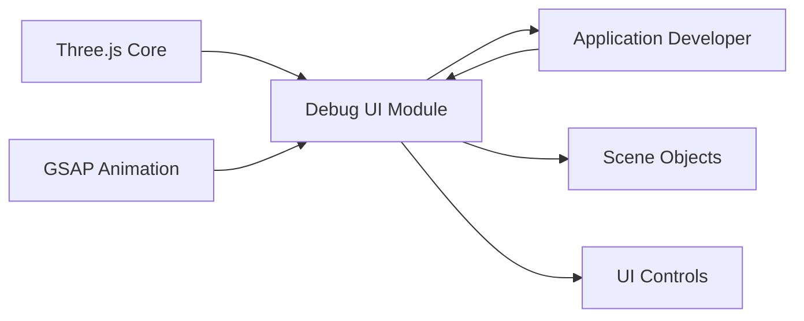

# Debug UI Module

## Overview
The Debug UI module integrates an interactive user interface into Three.js scenes, allowing real-time manipulation and inspection of 3D object properties during development. Its primary purpose is to enhance developer productivity by exposing object parameters, rendering settings, and scene controls via an on-screen panel, significantly streamlining the tuning and experimentation process for 3D applications.

## Key Features
- **Interactive Parameter Tweaking**: Adjust object properties (e.g., position, visibility, color, geometry subdivisions) directly from the UI without editing code.
- **Animation Triggers**: Launch custom actions, such as spinning a mesh, with dedicated UI controls.
- **Live Geometry Updates**: Modify geometry subdivision in real time, rebaking mesh geometry as needed.
- **Show/Hide UI**: Quickly hide or show the debug panel with the press of the `h` key, ensuring unobstructed workspace during runtime previews.
- **Control Folders**: Group related controls (e.g., all cube settings) for organized adjustment.
- **Color Picker Integration**: Change material colors interactively using a visual selector.
- **Wireframe Toggle**: Instantly switch material rendering modes to wireframe for debugging geometry.

## System Errors
- **UI Not Visible**
  - **Description**: If the debug UI does not appear, it may be hidden by default.
  - **Resolution**: Press the `h` key to toggle the visibility of the UI panel.
- **Geometry Not Updating**
  - **Description**: Changing subdivision does not visually update the cube geometry.
  - **Resolution**: Ensure you release the slider (onFinishChange). If issues persist, check for console errors indicating geometry disposal problems.
- **Unresponsive Controls**
  - **Description**: Adjusting controls has no visible effect.
  - **Resolution**: Confirm that the associated object (e.g., mesh/material) exists and is correctly referenced in the controls folder. Refresh the browser if values become desynced.

## Usage Examples

```js
import * as THREE from 'three'
import GUI from 'lil-gui'

// Initialize Debug UI
const gui = new GUI({ width: 300, title: 'Nice debug UI' })
const debugObject = { color: '#3a6ea6' }

// Create Three.js objects
const geometry = new THREE.BoxGeometry(1, 1, 1, 2, 2, 2)
const material = new THREE.MeshBasicMaterial({ color: debugObject.color })
const mesh = new THREE.Mesh(geometry, material)

// Add debug controls grouped in folder
const cubeTweaks = gui.addFolder('Awesome cube')
cubeTweaks.add(mesh.position, 'y').min(-3).max(3).step(0.01).name('elevation')
cubeTweaks.add(mesh, 'visible')
cubeTweaks.add(material, 'wireframe')
cubeTweaks.addColor(debugObject, 'color').onChange(() => {
    material.color.set(debugObject.color)
})
debugObject.spin = () => { /* animation logic */ }
cubeTweaks.add(debugObject, 'spin')

// Show or hide the UI with 'h' key
gui.hide()
window.addEventListener('keydown', (event) => {
    if(event.key == 'h')
        gui.show(gui._hidden)
})
```

## System Integration

