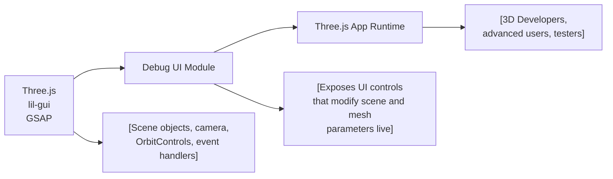

# Debug UI Module

## Overview
The **Debug UI Module** provides an interactive user interface (UI) layer using `lil-gui` for real-time inspection, debugging, and modification of scene and object properties within a Three.js 3D graphics application. This UI is intended primarily for developers and advanced users to quickly test parameters, observe changes live, and trigger custom debug actions within the running scene.

## Key Features

- **Interactive Parameter Control**: Offers GUI controls to manipulate cube object properties (position, visibility, wireframe mode) and scene materials in real time.
- **Dynamic Geometry Adjustment**: Allows runtime adjustment of the cube geometry's subdivision parameter, instantly updating the mesh geometry.
- **Live Color Editing**: Provides direct color pickers for materials, triggering immediate updates on change.
- **Animated Debug Actions**: Includes custom action buttons (e.g., "Spin") to trigger GSAP-powered animations on 3D objects.
- **Contextual Folder Organization**: Groups related controls for clarity (e.g., all cube parameters under "Awesome cube").
- **UI Visibility Management**: The debug UI is hidden by default and can be toggled using a keyboard shortcut (`h` key), preventing unnecessary UI clutter during normal use.

## System Errors

- **UI Not Visible**:  
  *Description*: The debug UI does not appear or is missing from the screen.  
  *Resolution*: The UI is intentionally hidden by default. Press the `h` key to toggle visibility. Ensure the canvas and script are loaded successfully.

- **Missing Controls for New Objects**:  
  *Description*: New mesh or material properties are not available in the debug UI.  
  *Resolution*: Only properties explicitly defined and connected through the debug UI code appear. Extend the script to add new controls for additional objects or parameters.

## Usage Examples

```js
// Import the Debug UI and set up a cube with controls:
import * as THREE from 'three'
import GUI from 'lil-gui'

// Initialize UI
const gui = new GUI({ width: 300, title: 'Nice debug UI' })
gui.hide()
window.addEventListener('keydown', (event) => {
    if (event.key == 'h') gui.show(gui._hidden)
})
const debugObject = { color: '#3a6ea6', subdivision: 2 }

// Three.js object setup
const geometry = new THREE.BoxGeometry(1, 1, 1, 2, 2, 2)
const material = new THREE.MeshBasicMaterial({ color: debugObject.color })
const mesh = new THREE.Mesh(geometry, material)

// Connect UI controls
const cubeTweaks = gui.addFolder('Awesome cube')
cubeTweaks.add(mesh.position, 'y').min(-3).max(3).step(0.01).name('elevation')
cubeTweaks.add(mesh, 'visible')
cubeTweaks.add(material, 'wireframe')
cubeTweaks.addColor(debugObject, 'color').onChange((value) => {
    material.color.set(debugObject.color)
})
cubeTweaks.add(debugObject, 'subdivision').min(1).max(20).step(1).onFinishChange(() => {
    mesh.geometry.dispose()
    mesh.geometry = new THREE.BoxGeometry(1, 1, 1, debugObject.subdivision, debugObject.subdivision, debugObject.subdivision)
})
// Make sure to add similar controls for other parameters as needed
```

## System Integration

