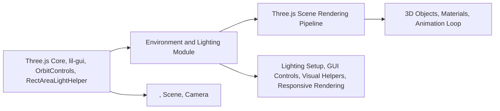

# Environment and Lighting

## Overview
This module manages environment and lighting for Three.js scenes, enabling realistic illumination and material interaction. It provides a range of physical and standard light sources, along with visual helpers and GUI controls, to create dynamic, interactive 3D scenes. The goal is to offer a flexible lighting setup that can be adjusted in real-time, making it suitable for visual experimentation, prototyping, and production rendering.

## Key Features

- **Multiple Light Source Types**: Supports Ambient, Directional, Hemisphere, Point, Rect Area, and Spot lights, each simulating different real-world lighting effects.  
  *Purpose*: Achieve various lighting scenarios, from global illumination to focused spot effects.

- **Live Lighting Controls**: Uses a GUI (lil-gui) to adjust key light parameters (like intensity) interactively.  
  *Purpose*: Fine-tune lighting on the fly without code changes.

- **Visual Light Helpers**: Includes helpers for each light type to visualize light properties and orientation in the scene.  
  *Purpose*: Easier debugging and understanding of light setups.

- **Material Standardization**: Ensures target objects use `MeshStandardMaterial`, allowing full utilization of advanced lighting and environment effects in Three.js.  
  *Purpose*: Consistent lighting response across all objects.

- **Responsive Rendering**: Updates camera and renderer settings on window resize to maintain correct aspect ratio and resolution.  
  *Purpose*: Guarantees scene remains visually consistent across devices and screen sizes.

## System Errors

- **Canvas Not Found**: If the canvas element with class `webgl` is missing, scene rendering will fail (no visible error, but blank output).  
  *Resolution*: Ensure the HTML contains `<canvas class="webgl"></canvas>`.

- **GUI Display Issues**: If lil-gui is not imported or fails to load, light controls will be unavailable.  
  *Resolution*: Check that lil-gui is properly installed and imported.

- **Unresponsive Scene After Window Resize**: If the renderer or camera is not properly updated on resize, visual artifacts or stretched images may appear.  
  *Resolution*: Verify the resize handler updates camera and renderer as provided.

## Usage Examples

```js
// HTML setup
<canvas class="webgl"></canvas>

// JavaScript module integration
import * as THREE from 'three'
import { OrbitControls } from 'three/examples/jsm/controls/OrbitControls.js'
import GUI from 'lil-gui'

// Lighting and Environment setup (from this module)
const gui = new GUI()
const scene = new THREE.Scene()
const ambientLight = new THREE.AmbientLight(0xffffff, 1)
scene.add(ambientLight)
gui.add(ambientLight, 'intensity').min(0).max(1)

const directionalLight = new THREE.DirectionalLight(0x00fffc, 1)
directionalLight.position.set(1, 0.25, 0)
scene.add(directionalLight)
gui.add(directionalLight, 'intensity').min(0).max(1)
// ... (other lights and helpers as per the module description)

// Responsive rendering and controls are managed by the module
// Now add your objects and call the animation loop
```

## System Integration


