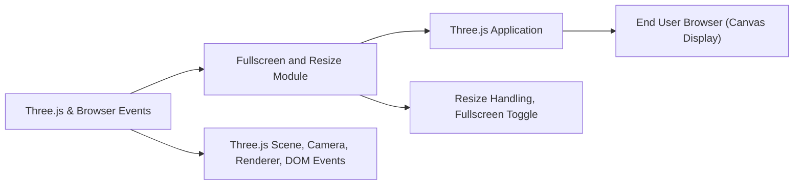

# Fullscreen and Resize Module

## Overview
This module enables dynamic resizing and fullscreen toggling for a WebGL canvas using Three.js. It ensures that the 3D scene remains responsive to browser window changes and allows the user to enter or exit fullscreen mode via double-click. The module is essential for delivering interactive and immersive 3D experiences adaptable to various display sizes.

## Key Features
- **Responsive Resize Handling**: The module listens for window resize events to automatically update canvas size, camera aspect ratio, and renderer settings, keeping the 3D scene properly scaled and undistorted.
- **Fullscreen Toggle Support**: Double-clicking the canvas enters or exits fullscreen mode. Handles both standard and WebKit-prefixed APIs for cross-browser compatibility.
- **Seamless Three.js Integration**: Integrates with the Three.js rendering loop and camera updates, ensuring smooth user interactions and proper rendering at all times.
- **Device Pixel Ratio Adjustment**: Automatically adapts rendering resolution to the device's pixel ratio for crisp visuals on high-DPI screens.

## System Errors
- **Incorrect Aspect Ratio**: The 3D scene may appear stretched or squashed if the camera's aspect ratio is not updated on window resize.  
  **Resolution**: Ensure `camera.aspect` and `camera.updateProjectionMatrix()` are called inside the resize event handler.
- **Fullscreen Not Triggering**: Some browsers restrict fullscreen API usage or require user interaction.  
  **Resolution**: Double-check browser permissions and feature support; always use user-initiated events like double-click.

## Usage Examples

```javascript
// Attach this logic after your initial Three.js setup

// Automatic handling of window resizing
window.addEventListener('resize', () => {
    sizes.width = window.innerWidth
    sizes.height = window.innerHeight

    camera.aspect = sizes.width / sizes.height
    camera.updateProjectionMatrix()

    renderer.setSize(sizes.width, sizes.height)
    renderer.setPixelRatio(Math.min(window.devicePixelRatio, 2))
})

// Double click to toggle fullscreen
window.addEventListener('dblclick', () => {
    if (!document.fullscreenElement && !document.webkitFullscreenElement) {
        if (canvas.requestFullscreen) {
            canvas.requestFullscreen()
        } else if (canvas.webkitRequestFullscreen) {
            canvas.webkitRequestFullscreen()
        }
    } else {
        if (document.exitFullscreen) {
            document.exitFullscreen()
        } else if (document.webkitExitFullscreen) {
            document.webkitExitFullscreen()
        }
    }
})
```

## System Integration

