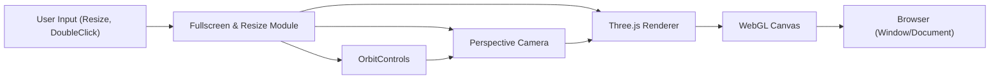

# Fullscreen & Resize Module

## Overview
The Fullscreen & Resize module enables seamless resizing of the rendering canvas and toggling fullscreen mode within a Three.js application. This feature ensures that the 3D scene dynamically adapts to browser window size changes and gives users an immersive fullscreen experience triggered via double-click. It is essential for creating interactive, visually consistent, and responsive 3D web applications.

## Key Features
- **Dynamic Canvas Resizing**: Automatically adjusts the Three.js renderer, camera aspect ratio, and rendering size in response to browser window size changes. Maintains correct proportions and responsiveness.
- **Fullscreen Mode Toggle**: Enables and exits browser-native fullscreen for the 3D canvas on double-click. Ensures compatibility across most modern browsers.
- **User Interaction Integration**: Combines OrbitControls for interactive camera movement with responsive rendering, maintaining usability regardless of window state.

## System Errors
- **Incorrect Canvas Size after Window Resize**: Occurs if renderer or camera is not updated on window resize.
  - **Resolution**: Ensure event listeners for `resize` are active and both renderer size and camera aspect are updated.
- **Fullscreen API Incompatibility**: Some browsers use prefixed methods (e.g., `webkitRequestFullscreen`), leading to fullscreen not working on certain platforms.
  - **Resolution**: Use fallbacks for vendor-prefixed fullscreen methods as demonstrated in the module.
- **Performance Drop at High DPI**: If `setPixelRatio` is too high, performance may degrade on devices with very high devicePixelRatio.
  - **Resolution**: Clamp pixel ratio with `Math.min(window.devicePixelRatio, 2)` to balance quality and performance.

## Usage Examples

```js
// Add the following to your Three.js project

import * as THREE from 'three'
import { OrbitControls } from 'three/examples/jsm/controls/OrbitControls'

const canvas = document.querySelector('canvas.webgl')
const scene = new THREE.Scene()

// ...add objects to the scene...

const sizes = {
    width: window.innerWidth,
    height: window.innerHeight
}

const camera = new THREE.PerspectiveCamera(75, sizes.width / sizes.height, 0.1, 100)
camera.position.z = 3
scene.add(camera)

const controls = new OrbitControls(camera, canvas)
controls.enableDamping = true

const renderer = new THREE.WebGLRenderer({ canvas: canvas })
renderer.setSize(sizes.width, sizes.height)
renderer.setPixelRatio(Math.min(window.devicePixelRatio, 2))

window.addEventListener('resize', () => {
    // Update sizes
    sizes.width = window.innerWidth
    sizes.height = window.innerHeight

    // Update camera
    camera.aspect = sizes.width / sizes.height
    camera.updateProjectionMatrix()

    // Update renderer
    renderer.setSize(sizes.width, sizes.height)
    renderer.setPixelRatio(Math.min(window.devicePixelRatio, 2))
})

window.addEventListener('dblclick', () => {
    if (!document.fullscreenElement) {
        canvas.requestFullscreen?.() || canvas.webkitRequestFullscreen?.()
    } else {
        document.exitFullscreen?.() || document.webkitExitFullscreen?.()
    }
})

// Standard render/animation loop
function animate() {
    controls.update()
    renderer.render(scene, camera)
    requestAnimationFrame(animate)
}

animate()
```

## System Integration


- **Dependencies**: User input events, Three.js (Renderer, Camera, OrbitControls)
- **This Module**: Listens for resize and fullscreen events, updates renderer and camera, manages fullscreen state.
- **Used By**: WebGL Canvas output, directly impacting the final rendered scene and user experience in the browser.