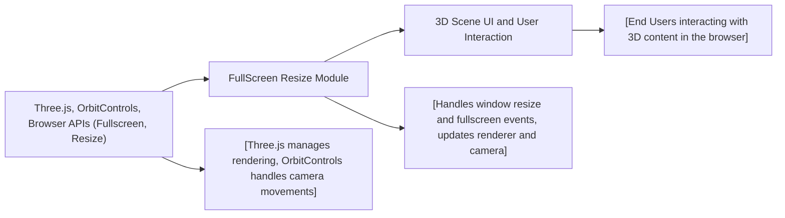

# FullScreen Resize Module

## Overview
The FullScreen Resize module enables Three.js scenes to seamlessly respond to browser window resizing and fullscreen mode changes. It ensures the 3D canvas always fills the viewport, updating rendering and camera configurations dynamically. This provides a smooth user experience across devices and display sizes.

## Key Features

- **Dynamic Canvas Resizing**: Automatically adjusts the canvas, renderer, and camera settings when the browser window size changes, keeping the scene proportional and responsive.
- **Fullscreen Toggle Support**: Allows users to enter and exit fullscreen mode via double-clicking the canvas, with cross-browser compatibility.
- **Automatic Pixel Ratio Adjustment**: Sets the renderer’s pixel ratio based on device capabilities for optimal visual fidelity and performance.
- **Orbit Controls Integration**: Enables intuitive user interaction with the 3D scene, supporting panning, zooming, and rotation with damping enabled.

## System Errors

- **Rendering Distortion After Resize**: Canvas or camera not updating after a window resize.
  - **Resolution**: Ensure the resize event handler updates both camera aspect and renderer size.
- **Fullscreen Not Working on Some Browsers**: Double-click does not enter fullscreen.
  - **Resolution**: Confirm browser supports the required fullscreen API or its webkit-prefixed variant; triggers may be blocked if used outside user interaction.
- **High Pixel Ratio Performance Issues**: Performance drops on high-DPI screens.
  - **Resolution**: Renderer pixel ratio is clamped to avoid excessive GPU load; check the pixel ratio logic.

## Usage Examples

```js
// Initialize the Three.js canvas using this module
import * as THREE from 'three';
import { OrbitControls } from 'three/examples/jsm/controls/OrbitControls.js';

const canvas = document.querySelector('canvas.webgl');
const scene = new THREE.Scene();
const camera = new THREE.PerspectiveCamera(75, window.innerWidth / window.innerHeight, 0.1, 100);
camera.position.z = 3;
scene.add(camera);

const renderer = new THREE.WebGLRenderer({ canvas });
renderer.setSize(window.innerWidth, window.innerHeight);

// Enable user interaction
const controls = new OrbitControls(camera, canvas);

window.addEventListener('resize', () => {
    camera.aspect = window.innerWidth / window.innerHeight;
    camera.updateProjectionMatrix();
    renderer.setSize(window.innerWidth, window.innerHeight);
    renderer.setPixelRatio(Math.min(window.devicePixelRatio, 2));
});

window.addEventListener('dblclick', () => {
    if (!document.fullscreenElement) {
        canvas.requestFullscreen?.() || canvas.webkitRequestFullscreen?.();
    } else {
        document.exitFullscreen?.() || document.webkitExitFullscreen?.();
    }
});
```

## System Integration

