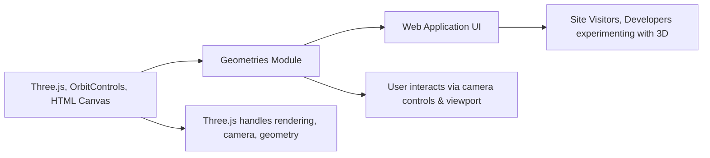

# Geometries Module

## Overview
The **Geometries Module** provides an interactive 3D visualization environment using Three.js. It enables users to render, display, and manipulate 3D custom geometries in the browser. This module is suited for web applications aiming to showcase or experiment with 3D mesh objects and camera controls within a performant, real-time rendering context.

## Key Features
- **Custom Geometry Rendering**: Generates and displays random 3D meshes using Three.js's `BufferGeometry` and `Mesh`.
- **Camera and Controls Integration**: Offers interactive camera movement with orbit controls, allowing users to navigate around the 3D scene smoothly.
- **Responsive Canvas**: Listens to window resizing events to adjust renderer and camera, ensuring graphics remain sharp and correctly scaled across devices.
- **Real-time Animation Loop**: Maintains a continuous animation/rendering cycle for fluid user interaction and graphics update.

## System Errors
- **Canvas Not Found**: If the `<canvas class="webgl">` is missing from the HTML, rendering and controls initialization will fail.
  - **Resolution**: Ensure your HTML includes `<canvas class="webgl"></canvas>` before loading the script.
- **WebGL Unsupported**: If the user's browser does not support WebGL, Three.js cannot render the scene.
  - **Resolution**: Use a modern browser with WebGL support.
- **Window Resize Errors**: Incorrect handling of resize events may cause the scene to display improperly.
  - **Resolution**: Ensure all size and camera updates are correctly synchronized in the event handler.

## Usage Examples

```js
// HTML setup
// <canvas class="webgl"></canvas>

// JavaScript entry (e.g., script.js)
import * as THREE from 'three';
import { OrbitControls } from 'three/examples/jsm/controls/OrbitControls.js';

// Select canvas and set up scene, camera, controls, and renderer
const canvas = document.querySelector('canvas.webgl');
const scene = new THREE.Scene();

// Create random geometry
const geometry = new THREE.BufferGeometry();
const count = 50;
const positionsArray = new Float32Array(count * 3 * 3); // 50 triangles
for (let i = 0; i < positionsArray.length; i++) {
    positionsArray[i] = Math.random() - 0.5;
}
geometry.setAttribute('position', new THREE.BufferAttribute(positionsArray, 3));

// Mesh with basic material
const material = new THREE.MeshBasicMaterial({ color: 0xff0000, wireframe: true });
const mesh = new THREE.Mesh(geometry, material);
scene.add(mesh);

// Responsive sizes
const sizes = { width: window.innerWidth, height: window.innerHeight };
window.addEventListener('resize', () => {
    sizes.width = window.innerWidth;
    sizes.height = window.innerHeight;
    camera.aspect = sizes.width / sizes.height;
    camera.updateProjectionMatrix();
    renderer.setSize(sizes.width, sizes.height);
    renderer.setPixelRatio(Math.min(window.devicePixelRatio, 2));
});

// Camera and controls
const camera = new THREE.PerspectiveCamera(75, sizes.width / sizes.height, 0.1, 100);
camera.position.z = 3;
scene.add(camera);
const controls = new OrbitControls(camera, canvas);
controls.enableDamping = true;

// Renderer setup
const renderer = new THREE.WebGLRenderer({ canvas });
renderer.setSize(sizes.width, sizes.height);
renderer.setPixelRatio(Math.min(window.devicePixelRatio, 2));

// Animation loop
const clock = new THREE.Clock();
const tick = () => {
    controls.update();
    renderer.render(scene, camera);
    window.requestAnimationFrame(tick);
};
tick();
```

## System Integration


