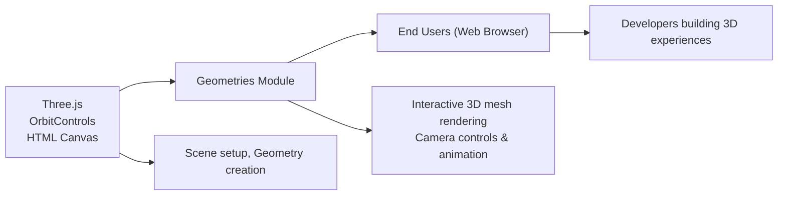

# Geometries Module

## Overview
The Geometries module provides a foundational setup for rendering and interacting with dynamic 3D shapes using [Three.js](https://threejs.org/). It creates a random, procedurally-generated mesh that users can view and manipulate in real time within a web browser. This module serves as a starting point for experimenting with 3D geometries, animation loops, camera controls, and responsive layouts.

## Key Features
- **Dynamic Geometry Creation**: Procedurally generates a mesh from random vertex positions on each page load. This demonstrates how to build and display custom shapes via Three.js's `BufferGeometry`.
- **Wireframe Visualization**: Renders the mesh in wireframe mode for clear visualization of its structure, supporting development and debugging tasks.
- **Real-Time Camera Controls**: Utilizes OrbitControls for intuitive camera movement, allowing users to explore the geometry interactively with mouse or touch.
- **Responsive Rendering**: Automatically adjusts rendering resolution and camera aspect ratio on window resize to ensure visual consistency across devices.
- **Continuous Animation Loop**: Maintains smooth and consistent updates of the scene, supporting future expansion for dynamic visualizations or animated geometries.

## System Errors
- **Canvas Not Found**:  
  *Description*: If the HTML canvas element with the `.webgl` class is missing, rendering will fail silently, and the scene will not be visible.  
  *Resolution*: Ensure your HTML contains `<canvas class="webgl"></canvas>` before the script is loaded.

- **Window Resize Issues**:  
  *Description*: If resize event listeners do not update the camera or renderer correctly, the scene may appear stretched or misaligned after resizing the browser window.  
  *Resolution*: Confirm that the event handler correctly updates both the camera’s aspect ratio and renderer’s size.

- **OrbitControls Import Failure**:  
  *Description*: If the OrbitControls module is not present or the path is incorrect, camera movement will be unavailable.  
  *Resolution*: Verify that `three/examples/jsm/controls/OrbitControls.js` exists within your project or node_modules, and is properly referenced.

## Usage Examples

```js
// Import Three.js and controls
import * as THREE from 'three'
import { OrbitControls } from 'three/examples/jsm/controls/OrbitControls.js'

// Get the canvas element
const canvas = document.querySelector('canvas.webgl')

// Set up the scene
const scene = new THREE.Scene()

// Create random geometry (e.g., random triangles)
const geometry = new THREE.BufferGeometry()
const count = 50 // Number of triangles
const positionsArray = new Float32Array(count * 3 * 3)
for (let i = 0; i < count * 3 * 3; i++) {
    positionsArray[i] = Math.random() - 0.5
}
geometry.setAttribute('position', new THREE.BufferAttribute(positionsArray, 3))

// Wireframe material
const material = new THREE.MeshBasicMaterial({ color: 0xff0000, wireframe: true })
const mesh = new THREE.Mesh(geometry, material)
scene.add(mesh)

// Set up camera, renderer, and controls
const sizes = { width: window.innerWidth, height: window.innerHeight }
const camera = new THREE.PerspectiveCamera(75, sizes.width / sizes.height, 0.1, 100)
camera.position.z = 3
scene.add(camera)

const renderer = new THREE.WebGLRenderer({ canvas })
renderer.setSize(sizes.width, sizes.height)
renderer.setPixelRatio(Math.min(window.devicePixelRatio, 2))

const controls = new OrbitControls(camera, canvas)
controls.enableDamping = true

// Responsive resize handling
window.addEventListener('resize', () => {
    sizes.width = window.innerWidth
    sizes.height = window.innerHeight
    camera.aspect = sizes.width / sizes.height
    camera.updateProjectionMatrix()
    renderer.setSize(sizes.width, sizes.height)
    renderer.setPixelRatio(Math.min(window.devicePixelRatio, 2))
})

// Animation loop
function animate() {
    controls.update()
    renderer.render(scene, camera)
    requestAnimationFrame(animate)
}
animate()
```

## System Integration


