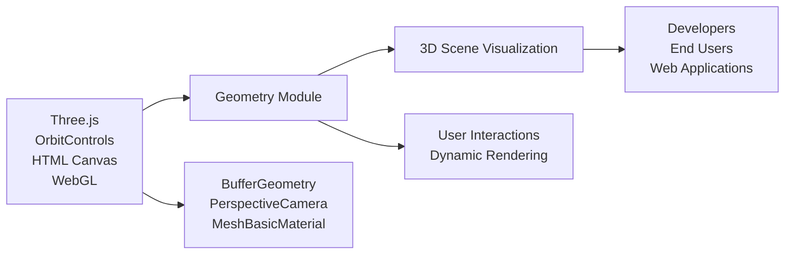

# Geometry Module

## Overview
The Geometry module provides interactive, randomized 3D geometry rendering within a web page using the Three.js framework. It acts as a foundation for displaying and experimenting with basic mesh objects, enabling real-time manipulation through user controls. This module is designed to demonstrate the integration of custom geometry with an interactive 3D viewport.

## Key Features
- **Randomized BufferGeometry Creation**: Generates a BufferGeometry with randomly positioned vertices, allowing users to visualize arbitrary, procedural 3D shapes.
- **WebGL-Based Rendering**: Utilizes Three.js’s WebGLRenderer to render graphics efficiently within the browser.
- **Responsive Canvas & Camera**: Automatically adjusts rendering size and perspective camera settings according to browser resize events for a seamless user experience.
- **Interactive Orbit Controls**: Integrates OrbitControls to allow users to rotate, pan, and zoom the camera dynamically around the geometry.

## System Errors
- **Canvas Not Found**: If `<canvas class="webgl">` is absent, rendering does not occur.  
  _Resolution_: Ensure that an HTML canvas element with `class="webgl"` exists before module initialization.
- **WebGL Context Loss**: Rendering may fail if browser or device does not support WebGL.  
  _Resolution_: Verify browser compatibility with WebGL and update GPU drivers as needed.
- **Window Resize Not Handled**: On abnormal window resizes, aspect ratio or renderer sizing may not update.  
  _Resolution_: Confirm that resize events are properly registered and all camera/renderer updates are applied.

## Usage Examples

```javascript
// HTML:
// <canvas class="webgl"></canvas>

// JS:
import * as THREE from 'three';
import { OrbitControls } from 'three/examples/jsm/controls/OrbitControls.js';

const canvas = document.querySelector('canvas.webgl');
const scene = new THREE.Scene();

// Create randomized geometry
const geometry = new THREE.BufferGeometry();
const count = 50;
const positionsArray = new Float32Array(count * 3 * 3);
for(let i = 0; i < positionsArray.length; i++) {
    positionsArray[i] = Math.random() - 0.5;
}
geometry.setAttribute('position', new THREE.BufferAttribute(positionsArray, 3));

// Add mesh with wireframe material
const material = new THREE.MeshBasicMaterial({ color: 0xff0000, wireframe: true });
const mesh = new THREE.Mesh(geometry, material);
scene.add(mesh);

// Setup camera, controls, and renderer
const sizes = { width: window.innerWidth, height: window.innerHeight };
const camera = new THREE.PerspectiveCamera(75, sizes.width / sizes.height, 0.1, 100);
camera.position.z = 3;
scene.add(camera);

const controls = new OrbitControls(camera, canvas);
controls.enableDamping = true;

const renderer = new THREE.WebGLRenderer({ canvas: canvas });
renderer.setSize(sizes.width, sizes.height);
renderer.setPixelRatio(Math.min(window.devicePixelRatio, 2));

// Responsive resizing
window.addEventListener('resize', () => {
    sizes.width = window.innerWidth;
    sizes.height = window.innerHeight;
    camera.aspect = sizes.width / sizes.height;
    camera.updateProjectionMatrix();
    renderer.setSize(sizes.width, sizes.height);
    renderer.setPixelRatio(Math.min(window.devicePixelRatio, 2));
});

// Animation loop
const clock = new THREE.Clock();
const tick = () => {
    controls.update();
    renderer.render(scene, camera);
    window.requestAnimationFrame(tick);
};
tick();
```

## System Integration


