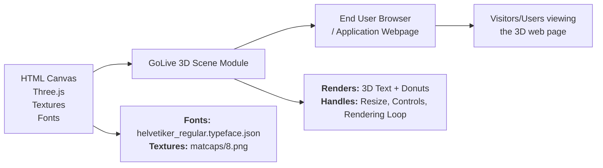

# GoLive 3D Scene Module

## Overview
The **GoLive 3D Scene Module** is a feature-rich, embeddable component for rendering interactive 3D scenes using [Three.js](https://threejs.org/). It enables the display of custom 3D text with "matcap" material effects, surrounded by multiple randomly-distributed torus ("donut") shapes. The module is designed to serve as a learning or demo platform for real-time 3D web graphics, providing intuitive camera controls and automatic adaptation to viewport changes. It integrates seamlessly into browser-based applications by mounting onto a `<canvas>` element.

## Key Features

- **3D Text Rendering**: Creates and centers a customizable 3D text geometry, using externally loaded font data and advanced material effects for rich visual presentation.
- **Randomized Donut Field**: Populates the scene with 100 torus meshes, each randomly positioned, rotated, and scaled, adding a dynamic spatial environment around the focal text.
- **Flexible Camera & Controls**: Includes an interactive perspective camera with orbiting and damping functionalities, allowing users to navigate the 3D scene intuitively.
- **Responsive Rendering**: Automatically responds to browser window resizing to maintain correct aspect ratio and pixel density, ensuring consistent visual quality across devices.
- **Matcap Material Support**: Utilizes a matcap texture for material, providing visually pleasing, efficiently-rendered shading effects without complex lighting calculations.
- **Modular Integration**: Hooks into any HTML page with a `<canvas class="webgl">` element, supporting ES module imports and intuitive initialization.

## System Errors

- **Asset Loading Errors**:  
  _Description_: Font or texture assets may fail to load if paths are incorrect or files are missing (e.g., `/fonts/helvetiker_regular.typeface.json` or `textures/matcaps/8.png`).  
  _Resolution_: Ensure asset files exist at specified locations and paths are correct relative to the root or distribution folder.

- **Canvas Not Found**:  
  _Description_: If the target `<canvas class="webgl">` element is missing from the DOM, the scene will not render and JavaScript errors may occur.  
  _Resolution_: Confirm that your HTML includes exactly one canvas element with class `webgl`.

- **WebGL Not Supported**:  
  _Description_: Older browsers or unsupported platforms may not support WebGL, causing rendering failures.  
  _Resolution_: Advise users to use a WebGL-compatible browser (e.g., recent Chrome, Firefox, Edge).

## Usage Examples

```js
// index.html
// Ensure HTML includes:
<canvas class="webgl"></canvas>

// script.js (ES module)
import * as THREE from 'three'
import { OrbitControls } from 'three/examples/jsm/controls/OrbitControls.js'
import { FontLoader } from 'three/examples/jsm/loaders/FontLoader.js'
import { TextGeometry } from 'three/examples/jsm/geometries/TextGeometry.js'
import GUI from 'lil-gui'

// No explicit API construction needed—module will auto-initialize and render
// 3D scene when loaded, mounting onto 'canvas.webgl' element
```

This module is auto-initializing and doesn't require manual instantiation. Place your `<canvas>` in HTML, ensure expected assets (font files, matcap textures) exist in the appropriate paths, and the 3D scene will display and respond to navigation or resizing automatically.

## System Integration


