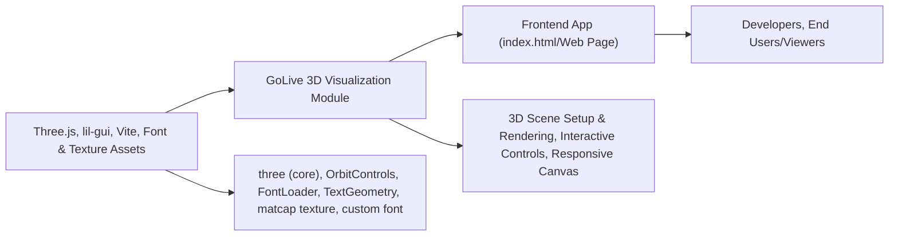

# GoLive Three.js Visualization Module

## Overview
The GoLive module renders an interactive 3D visualization using Three.js. It displays dynamic 3D text and a visually rich scene with randomized "donut" meshes, leveraging real-time controls and responsive adjustments. This module is designed for rapid prototyping, demos, or educational showcases of core Three.js concepts and user-experience interactivity. It integrates smoothly into modern frontend projects using Vite as a build tool.

## Key Features
- **Interactive 3D Scene**: Renders a real-time 3D environment with animated camera controls and dynamic lighting, providing immersive user interaction.
- **Customizable 3D Text**: Loads custom font geometry and renders 3D text with matcap materials, demonstrating Three.js text rendering capabilities.
- **Procedurally Generated Meshes**: Automatically distributes and scales multiple 3D torus ("donut") objects throughout the scene for visual density and variation.
- **Responsive Rendering**: Listens to window resize events to dynamically adjust camera and renderer settings, ensuring consistent display across devices.
- **User Controls Integration**: Incorporates OrbitControls for smooth camera navigation and lil-gui for potential real-time parameter adjustments and debugging.
- **Seamless Build & Dev Workflow**: Utilizes Vite for development and production builds, supporting quick iterations and easy deployment.

## System Errors

- **Texture or Font Asset Not Found**:  
  *Description*: If texture (`textures/matcaps/8.png`) or font (`fonts/helvetiker_regular.typeface.json`) files are missing or follow incorrect paths, 3D materials or text may not render at all.  
  *Resolution*: Ensure the referenced asset files exist at the specified paths in your static/public directory and are accessible by the server.

- **Canvas Element Missing**:  
  *Description*: If there is no `<canvas class="webgl">` in the HTML, rendering will fail and `Three.js` will not attach the scene.  
  *Resolution*: Confirm that the HTML includes a `<canvas class="webgl"></canvas>` element as required.

- **Renderer or Camera Resize Issue**:  
  *Description*: Unexpected behavior or aspect ratio distortion can occur if window resize events are not handled correctly.  
  *Resolution*: Make sure the event listeners and update logic are intact and not modified in a way that would break renderer or camera updates.

## Usage Examples

```js
// To use GoLive module, ensure required dependencies and assets are present,
// then run the development server:

// Terminal commands:
npm install      // Install dependencies (three, lil-gui, vite)
npm run dev      // Start development server (default: http://localhost:8080)

// Key integration in src/index.html:
<canvas class="webgl"></canvas>
<script type="module" src="./script.js"></script>

// Main Three.js setup (see script.js):
import * as THREE from 'three'
import { OrbitControls } from 'three/examples/jsm/controls/OrbitControls.js'
import { FontLoader } from 'three/examples/jsm/loaders/FontLoader.js'
import { TextGeometry } from 'three/examples/jsm/geometries/TextGeometry.js'
import GUI from 'lil-gui'

// Scene setup, text rendering, mesh generation, camera/responsiveness,
// and animation are handled automatically by src/script.js when included.
```

## System Integration

