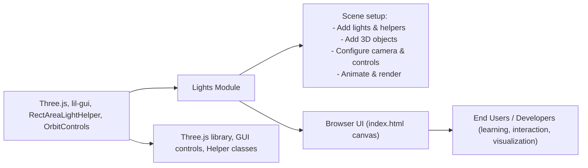

# Lights Module

## Overview
The **Lights Module** demonstrates and manages various lighting types within a Three.js 3D scene. Acting as an educational and feature-rich sample, this module integrates six essential Three.js light sources (ambient, directional, hemisphere, point, rectangular area, and spot lights) alongside real-time settings controls and helper visualizations. The core purpose is to show how different lighting models affect scene rendering, empowering users to adjust parameters interactively and understand lighting in a real-time, browser-based context.

## Key Features

- **Multiple Light Types**: Provides and configures six major Three.js light sources—Ambient, Directional, Hemisphere, Point, RectArea, and SpotLight—each with distinct characteristics and behaviors.
- **Live Settings with GUI Controls**: Integrates lil-gui controls for real-time adjustment of each light’s intensity, helping users understand and fine-tune lighting setups interactively.
- **Visual Light Helpers**: Adds Three.js-provided helper objects for each light to make the effect and orientation of the lights immediately clear within the 3D viewport.
- **3D Object Illumination**: Includes various geometries (sphere, cube, torus, plane) with standard materials to visibly demonstrate the consequences of different lighting conditions.
- **Responsive Rendering**: Updates renderer, camera, and controls on browser resize, maintaining correct aspect ratios and consistent lighting appearances.
- **Orbit Camera Controls**: Uses OrbitControls for intuitive camera manipulation, enabling users to explore lighting effects from different angles.
- **Modern Web Integration**: Utilizes Vite for fast local development/build, and renders via a fixed-position canvas for pixel-perfect, full-viewport experiences.

## System Errors

- **Canvas Not Found**:  
  - *Description*: The script expects a `<canvas class="webgl">` element in the HTML. If missing, the Three.js renderer cannot attach, resulting in runtime errors.
  - *Resolution*: Ensure `<canvas class="webgl"></canvas>` exists in the HTML body where the Lights module is loaded.
- **Unsupported Browser/WebGL Failure**:  
  - *Description*: The module depends on WebGL, which may not be available or enabled in all environments.
  - *Resolution*: Update/enable WebGL support in the browser; check browser compatibility for modern Three.js.
- **Resize Handling**:  
  - *Description*: If the window is resized in a non-standard DOM environment (or if relevant events are prevented), the camera and renderer could display incorrect proportions.
  - *Resolution*: Allow default resize event propagation, or avoid manipulating window sizing/events that affect rendering.

## Usage Examples

```js
// 1. Import in your entry script (assumed to be in a module-aware environment)
import * as THREE from 'three'

// 2. Ensure there is a canvas element with class "webgl" in your HTML:
// <canvas class="webgl"></canvas>

// 3. Run the lights module setup:
import './script.js'

// 4. Interact with the live lil-gui controls to adjust individual light intensities:
/// gui.add(light, 'intensity').min(0).max(<value>).step(<value>)

// The canvas will now display animated 3D objects illuminated by six light types.
// Use the GUI to toggle intensities and see instant lighting changes.
// Use mouse/touch to orbit the camera and observe light responses on object surfaces.
```

## System Integration


