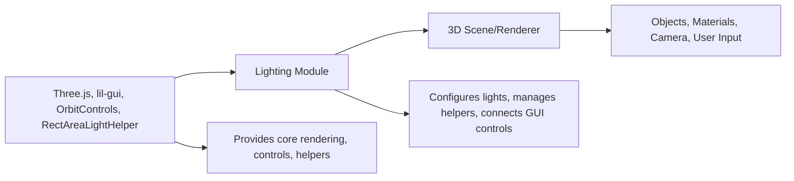

# Lighting Module

## Overview
The Lighting Module provides a comprehensive setup of various light sources and their real-time controls in a Three.js scene. It is designed to help users experiment with and visualize different lighting effects using multiple light types, each of which can be adjusted interactively for intensity and position. It seamlessly integrates with object rendering and user camera controls, serving as a foundational reference or starting point for interactive 3D visualizations that require dynamic lighting.

## Key Features
- **Multiple Light Types**: Integrates Ambient, Directional, Hemisphere, Point, RectArea, and Spot lights into a single Three.js scene, showcasing their combined effects.
- **Real-Time GUI Controls**: Offers interactive adjustment of each light's intensity using a GUI panel, enabling instant visual feedback for lighting configuration.
- **Visual Light Helpers**: Includes scene helpers for each light type, making it easy to visualize light locations, directions, and influence areas directly within the scene.
- **Lighting Integration with 3D Objects**: Illumination setup directly affects standard material 3D primitives (sphere, cube, torus, and plane), demonstrating the interaction between lights and objects.
- **Responsive and Interactive**: Automatically adapts to window resize events and supports camera manipulation via orbit controls, ensuring usability across different device sizes and user actions.

## System Errors
- **GUI Not Displaying or Non-Responsive**:  
  Description: The control panel for adjusting light properties does not appear or fails to respond.  
  Resolution: Ensure that `lil-gui` is properly installed as a dependency. Check for errors in the browser console and verify that the module is correctly imported.

- **Canvas Not Rendering / Blank Scene**:  
  Description: The 3D scene remains blank or does not show expected objects and lighting effects.  
  Resolution: Confirm the `<canvas class="webgl">` element exists in the HTML and that `script.js` is being loaded as a module. Make sure all resources are properly built and server is running if using a development server.

- **Unexpected Lighting Artifacts or No Lighting Effects**:  
  Description: Objects appear unlit or lighting changes have no effect.  
  Resolution: Check that lights are being added to the scene and that object materials are compatible with lighting (e.g., using `MeshStandardMaterial`). Inspect GUI control ranges for unintended values (e.g., intensity set to zero).

## Usage Examples

```js
// Import required Three.js modules and controls
import * as THREE from 'three';
import { OrbitControls } from 'three/examples/jsm/controls/OrbitControls.js';
import GUI from 'lil-gui';

// Setup scene and canvas
const scene = new THREE.Scene();
const canvas = document.querySelector('canvas.webgl');

// Add and configure lights with GUI controls
const gui = new GUI();
const ambientLight = new THREE.AmbientLight(0xffffff, 1);
scene.add(ambientLight);
gui.add(ambientLight, 'intensity').min(0).max(1).step(.001);

// Add a mesh to see lighting effects
const material = new THREE.MeshStandardMaterial({ roughness: 0.4 });
const cube = new THREE.Mesh(new THREE.BoxGeometry(1, 1, 1), material);
scene.add(cube);

// Setup camera and renderer
const camera = new THREE.PerspectiveCamera(75, window.innerWidth / window.innerHeight, 0.1, 100);
camera.position.set(1, 1, 2);
scene.add(camera);

const renderer = new THREE.WebGLRenderer({ canvas });
renderer.setSize(window.innerWidth, window.innerHeight);
renderer.setPixelRatio(Math.min(window.devicePixelRatio, 2));

// Animate and render
function animate() {
    requestAnimationFrame(animate);
    cube.rotation.y += 0.01;
    renderer.render(scene, camera);
}
animate();
```

## System Integration


