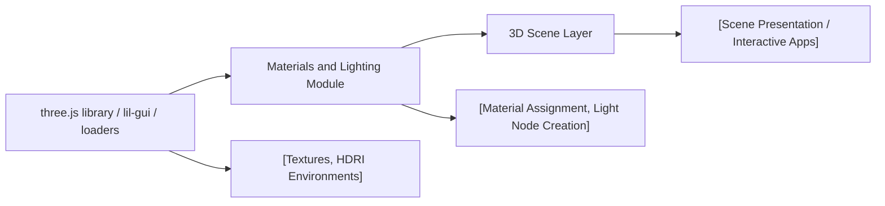

# Materials and Lighting

## Overview
The **Materials and Lighting** modules add realism and visual detail to 3D scenes powered by Three.js by enabling advanced material properties and versatile lighting controls. They allow developers to assign a wide range of physical attributes to 3D objects and illuminate them using multiple configurable light types. Together, these modules form the foundational layer for rendering visually compelling 3D environments, supporting workflows that require both photorealistic and stylized effects.

## Key Features

- **Physically-Based Material System**: Assigns advanced material types (e.g., MeshPhysicalMaterial, MeshStandardMaterial) to 3D objects, supporting parameters like metalness, roughness, transparency, iridescence, and clearcoat for realistic surface appearance.
- **Multi-Channel Texture Mapping**: Supports multiple material texture maps, including diffuse/albedo, normal, ambient occlusion, height, metalness, roughness, and alpha transparency, allowing fine-grained visual customization.
- **Lighting Types and Controls**: Provides multiple light sources (Ambient, Directional, Point, Hemisphere, RectArea, Spot), configurable in real-time using a GUI for intensity and position adjustments.
- **Lighting Helpers and Visualization**: Integrates geometric helpers for each light type, visually indicating light positions, ranges, and effects, simplifying debugging and scene composition.
- **Dynamic Environment Mapping**: Applies HDRI-based environment lighting, adding realistic ambient effects and reflections to physically based materials.
- **Live Scene Controls**: Offers interactive camera controls and GUI-based parameter tweaking, enabling real-time material and lighting adjustments for rapid prototyping and presentation.

## System Errors

- **Missing or Invalid Texture**: If a required texture (e.g., normal map or environment HDR) fails to load, material appearance may default to flat or incorrect rendering.
  - *Resolution*: Ensure texture paths and file formats are correct; check network or file access permissions.
- **Incorrect Mapping or Scale**: Objects may appear distorted or lighting/reflections look incorrect if UV mapping is missing or environment mapping parameters are misconfigured.
  - *Resolution*: Verify geometry supports the required UVs; check material texture channel assignments and map settings.
- **Performance Degradation**: High-resolution textures or numerous physical lights may cause rendering lags, especially on low-end hardware.
  - *Resolution*: Optimize texture resolutions, limit active dynamic lights, and use appropriate renderer settings.
- **Lighting Artifacts with Helpers**: Light helper objects may remain visible in final renders unintentionally.
  - *Resolution*: Remove or toggle visibility of helper objects before exporting final scenes or during runtime as needed.

## Usage Examples

```js
// Materials: Assigning a MeshPhysicalMaterial with advanced texture maps
const doorColor = textureLoader.load('textures/door/color.jpg');
const doorRoughness = textureLoader.load('textures/door/roughness.jpg');

const material = new THREE.MeshPhysicalMaterial({
  map: doorColor,
  roughnessMap: doorRoughness,
  metalness: 0.7,
  roughness: 0.2,
  transparent: true,
  alphaMap: textureLoader.load('textures/door/alpha.jpg'),
  transmission: 1.0, // For glass-like transparency
  ior: 1.5,
  thickness: 0.5
});

// Live tweaking with GUI
gui.add(material, 'metalness', 0, 1);
gui.add(material, 'roughness', 0, 1);

// Lighting: Adding and configuring multiple lights with helpers
const ambientLight = new THREE.AmbientLight(0xffffff, 0.5);
scene.add(ambientLight);
const pointLight = new THREE.PointLight(0xff9000, 1.5, 10, 2);
pointLight.position.set(2, -0.5, 1);
scene.add(pointLight);

// Visualize with helpers
scene.add(new THREE.PointLightHelper(pointLight, 0.2));

// Camera controls and live updates
const controls = new OrbitControls(camera, canvas);
controls.enableDamping = true;
```

## System Integration


