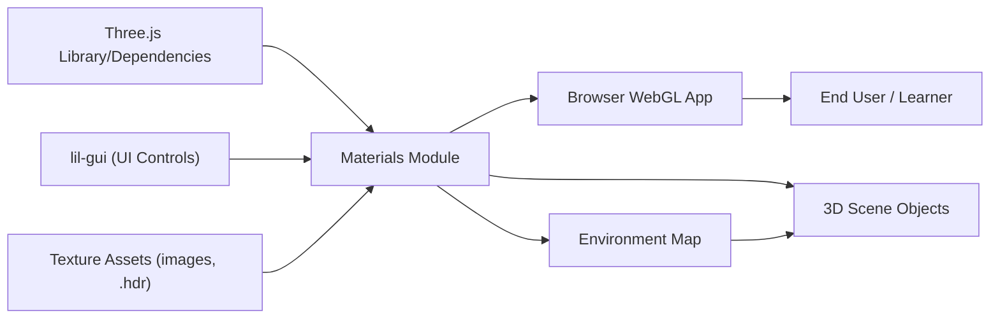

# Materials Module

## Overview
The Materials module demonstrates advanced material rendering in Three.js, showcasing how to combine multiple physically-based parameters and texture maps for realistic surface effects. It serves as an interactive example where users can explore and tweak material properties in real-time using a GUI, view results across common geometry types, and see the effect of environmental lighting. The module’s primary goal is to teach and provide a starting template for realistic material configuration and visualization in browser-based 3D scenes.

## Key Features

- **Physically-Based Materials**: Utilizes `MeshPhysicalMaterial` to simulate real-world surface properties, enabling effects such as metalness, roughness, transmission, and more.
- **Multi-Map Texturing**: Supports color, alpha, ambient occlusion, height (displacement), normal, metalness, and roughness maps for detailed and varied material appearances.
- **Environmental Lighting**: Integrates HDR environment maps for realistic lighting and reflections, affecting material appearance dynamically.
- **Interactive Parameter Control**: Includes a live GUI (via lil-gui) to adjust material properties (metalness, roughness, transmission, thickness, IOR, etc.) and instantly observe changes.
- **Multiple Geometries**: Applies the material to different mesh shapes (sphere, plane, torus) to demonstrate the effect of properties across geometries.
- **Responsive Rendering**: Adjusts rendering and camera on window resize for an always-optimal viewport and pixel ratio.
- **Camera Controls**: Employs orbital camera controls for user-friendly scene exploration.

## System Errors

- **Texture Loading Error**:  
  _Description_: If texture files are missing or paths are incorrect, textures will fail to load and surfaces may render incorrectly or as solid colors.  
  _Resolution_: Ensure all referenced texture files exist at the given paths (`./textures/...`). Check browser console for loading errors.

- **WebGL Context Not Supported**:  
  _Description_: On unsupported browsers or devices, the canvas may fail to initialize a WebGL context, resulting in a blank scene.  
  _Resolution_: Use an up-to-date browser with WebGL support. Verify hardware acceleration is enabled.

- **GUI/Controls Not Responsive After Resize**:  
  _Description_: If the renderer or camera fails to update, aspect ratios may appear distorted or controls can become misaligned.  
  _Resolution_: Confirm the resize event is firing and the handler appropriately updates both the camera and renderer. Refresh browser if necessary.

## Usage Examples

```javascript
// Import Three.js and dependencies
import * as THREE from 'three'
import { OrbitControls } from 'three/examples/jsm/controls/OrbitControls.js'
import GUI from 'lil-gui'
import { RGBELoader } from 'three/examples/jsm/loaders/RGBELoader.js'

// 1. Setup scene, camera, renderer, and canvas
const canvas = document.querySelector('canvas.webgl')
const scene = new THREE.Scene()
const camera = new THREE.PerspectiveCamera(75, window.innerWidth/window.innerHeight, 0.1, 100)
camera.position.set(1, 1, 2)
scene.add(camera)
const renderer = new THREE.WebGLRenderer({ canvas })
renderer.setSize(window.innerWidth, window.innerHeight)

// 2. Load textures and configure material
const textureLoader = new THREE.TextureLoader()
const material = new THREE.MeshPhysicalMaterial({
  map: textureLoader.load('./textures/door/color.jpg'),
  metalness: 0.7,
  roughness: 0.2,
  transparent: true,
  alphaMap: textureLoader.load('./textures/door/alpha.jpg'),
  aoMap: textureLoader.load('./textures/door/ambientOcclusion.jpg'),
  displacementMap: textureLoader.load('./textures/door/height.jpg'),
  displacementScale: 0.2,
  metalnessMap: textureLoader.load('./textures/door/metalness.jpg'),
  roughnessMap: textureLoader.load('./textures/door/roughness.jpg'),
  normalMap: textureLoader.load('./textures/door/normal.jpg'),
  normalScale: new THREE.Vector2(0.5, 0.5),
  transmission: 1,
  ior: 1.5,
  thickness: 0.5
})

// 3. Add meshes
const sphere = new THREE.Mesh(new THREE.SphereGeometry(0.5, 64, 64), material)
const plane = new THREE.Mesh(new THREE.PlaneGeometry(1, 1, 100, 100), material)
const torus = new THREE.Mesh(new THREE.TorusGeometry(0.3, 0.2, 64, 128), material)
scene.add(sphere, plane, torus)

// 4. Apply environment map
const rgbeLoader = new RGBELoader()
rgbeLoader.load('./textures/environmentMap/2k.hdr', (envMap) => {
  envMap.mapping = THREE.EquirectangularReflectionMapping
  scene.background = envMap
  scene.environment = envMap
})

// 5. Add controls and GUI
const controls = new OrbitControls(camera, canvas)
controls.enableDamping = true
const gui = new GUI()
gui.add(material, 'metalness', 0, 1, 0.0001)
gui.add(material, 'roughness', 0, 1, 0.0001)
gui.add(material, 'transmission', 0, 1, 0.0001)
gui.add(material, 'ior', 1, 10, 0.0001)
gui.add(material, 'thickness', 0, 1, 0.0001)

// 6. Render loop with rotation animation
function animate() {
  requestAnimationFrame(animate)
  sphere.rotation.y += 0.01
  plane.rotation.y += 0.01
  torus.rotation.y += 0.01
  controls.update()
  renderer.render(scene, camera)
}
animate()
```

## System Integration


