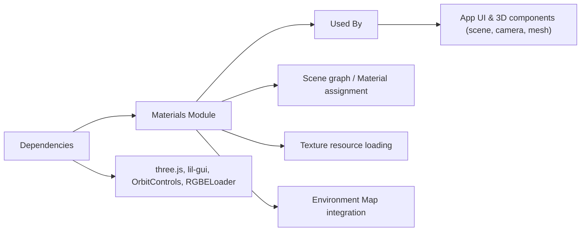

# Materials Module

## Overview
The **Materials Module** provides a feature-rich integration of physically-accurate and stylized materials using [three.js](https://threejs.org/) for 3D visualizations. It enables loading, configuring, and combining various material effects such as metalness, roughness, transparency, normal mapping, and environment mapping. This module is designed to demonstrate or prototype real-time 3D material behaviors in web applications, with interactive controls for fine-tuning material properties.

## Key Features
- **Physically-Based Rendering (PBR) Materials**: Supports advanced three.js materials, including `MeshPhysicalMaterial` for realistic rendering.
- **Texture Loading and Mapping**: Automatic loading and assignment of multiple texture maps (albedo, normal, metalness, roughness, ambient occlusion, etc.).
- **Environment Mapping**: Integration with HDR environment maps for accurate lighting and reflections.
- **Real-time UI Controls**: Interactive GUI for tweaking key material properties like metalness, roughness, ior, and transparency live in the browser.
- **Object Material Sharing**: Single material instance can be assigned to multiple mesh objects for consistent visual style.
- **Responsive Rendering**: Adapts rendering and camera parameters on window resize for optimal display.
- **Orbit Controls**: Seamless camera navigation for inspecting material effects in 3D.

## System Errors
- **Texture Loading Error**:  
  _Description_: If a required texture file is missing or misnamed, the relevant map (e.g., normal, diffuse) may be blank, or errors/warnings may appear in the browser console.  
  _Resolution_: Verify that all texture paths are correct and files are present under the `textures/` directory.

- **HDR Environment Map Load Failure**:  
  _Description_: If the HDR file cannot be loaded, background and reflections will not appear as intended, resulting in flat shading or incorrect lighting.  
  _Resolution_: Ensure the HDR file exists at the specified path and is a valid format supported by RGBELoader.

- **GUI/Property Mutation Error**:  
  _Description_: Properties edited in the GUI may not take effect if the material property name is incorrect or not supported by the selected material type.  
  _Resolution_: Use the provided controls as-is and check material type before adding new controls.

## Usage Examples

```js
// Import necessary three.js modules
import * as THREE from 'three'
import { OrbitControls } from 'three/examples/jsm/controls/OrbitControls.js'
import { RGBELoader } from 'three/examples/jsm/loaders/RGBELoader.js'
import GUI from 'lil-gui'

// Set up scene, camera, and WebGL renderer using a <canvas> with class "webgl".
const scene = new THREE.Scene()
const camera = new THREE.PerspectiveCamera(75, window.innerWidth/window.innerHeight, 0.1, 100)
const canvas = document.querySelector('canvas.webgl')
const renderer = new THREE.WebGLRenderer({ canvas })

// Load textures for PBR material
const textureLoader = new THREE.TextureLoader()
const colorMap = textureLoader.load('./textures/door/color.jpg')
// ... load other required textures (normal, roughness, etc.)

// Configure a MeshPhysicalMaterial with multiple texture maps and PBR properties
const material = new THREE.MeshPhysicalMaterial({
  map: colorMap,
  metalness: 0.7,
  roughness: 0.2,
  transparent: true,
  alphaMap: textureLoader.load('./textures/door/alpha.jpg'),
  /* assign other maps as needed */
})

// Add live GUI controls (optional)
const gui = new GUI()
gui.add(material, 'metalness').min(0).max(1).step(0.0001)
gui.add(material, 'roughness').min(0).max(1).step(0.0001)

// Create meshes and add to scene
const sphere = new THREE.Mesh(new THREE.SphereGeometry(0.5, 64, 64), material)
scene.add(sphere)

// Set up HDR environment map (background/reflection)
const rgbeLoader = new RGBELoader()
rgbeLoader.load('./textures/environmentMap/2k.hdr', envMap => {
  envMap.mapping = THREE.EquirectangularReflectionMapping
  scene.background = envMap
  scene.environment = envMap
})

// Add orbit controls and start animation/render loop
const controls = new OrbitControls(camera, canvas)
function animate() {
  controls.update()
  renderer.render(scene, camera)
  requestAnimationFrame(animate)
}
animate()
```

## System Integration


**Legend**:  
- **Dependencies**: third-party libraries (three.js, lil-gui, loaders)  
- **This Module**: Material configuration & runtime control  
- **Used By**: Application's scene setup and 3D UI components  
- **Process** nodes: Material attached to meshes, resource loading, environmental effects

---

This module enables interactive, realistic material exploration in web-based 3D scenes, streamlining texture management and real-time adjustments for artists and developers.