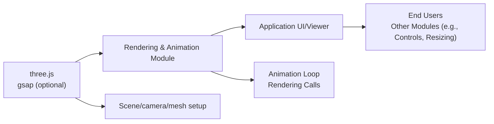

# Rendering & Animation Module

## Overview
The Rendering & Animation module is responsible for displaying and animating 3D scenes in the browser using Three.js. It provides a foundational animation loop and rendering pipeline, handling scene setup, camera positioning, mesh rendering, and object animation over time. This module enables dynamic visualizations by continuously updating object states and rendering the results to a WebGL canvas.

## Key Features
- **3D Scene Rendering**: Renders Three.js scenes to a specified canvas, forming the basis for all visual outputs.
- **Animation Loop Management**: Uses a continuous tick function based on requestAnimationFrame for smooth, real-time updates and animations.
- **Custom Object Animation**: Demonstrates how to animate mesh properties (e.g., position) over time using mathematical functions or animation libraries such as GSAP.
- **Camera Integration**: Positions and attaches a perspective camera to the scene, establishing the viewpoint for rendering.

## System Errors
- **WebGL Context Not Available**: If the canvas selector `.webgl` does not exist or fails to initialize, rendering will not occur.
  - *Resolution*: Ensure a `<canvas class="webgl"></canvas>` exists in the HTML before the script is loaded.
- **Mesh or Scene Updates Not Reflected**: If animation code (e.g., modifying mesh positions) fails to execute (such as due to missing objects), objects will not appear to move.
  - *Resolution*: Verify that objects are correctly created and added to the scene before animation logic runs.

## Usage Examples

```js
// Rendering & animation loop with Three.js

import * as THREE from 'three'
// Optionally, import GSAP for advanced animations
// import gsap from 'gsap'

// Canvas setup
const canvas = document.querySelector('canvas.webgl')

// Scene setup
const scene = new THREE.Scene()
const geometry = new THREE.BoxGeometry(1, 1, 1)
const material = new THREE.MeshBasicMaterial({ color: 0xff0000 })
const mesh = new THREE.Mesh(geometry, material)
scene.add(mesh)

// Camera setup
const camera = new THREE.PerspectiveCamera(75, 800 / 600)
camera.position.z = 3
scene.add(camera)

// Renderer setup
const renderer = new THREE.WebGLRenderer({ canvas })
renderer.setSize(800, 600)

// Animation loop
const clock = new THREE.Clock()
const tick = () => {
    const elapsedTime = clock.getElapsedTime()
    // Animate mesh position in a circular path
    mesh.position.y = Math.sin(elapsedTime)
    mesh.position.x = Math.cos(elapsedTime)
    renderer.render(scene, camera)
    window.requestAnimationFrame(tick)
}
tick()
```

## System Integration


