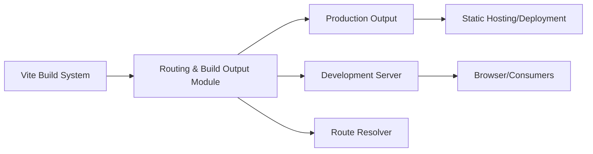

# Routing and Build Output Configuration

## Overview
This module configures the root directory, public assets location, server options, and build output paths for the Vite-based frontend environment. It ensures that development and production builds serve the correct files from appropriate locations—crucial for accurate routing, static asset resolution, and seamless local/network preview.

## Key Features
- **Root Source Directory**: Sets the source entry point for the Vite server, determining how routes resolve during development and build.
- **Custom Public Directory**: Specifies a public assets directory, so static content is served at the root during both development and production.
- **Base Path Configuration**: Defines the base URL for serving assets, ensuring relative asset loading when deployed in subfolders.
- **Network-Accessible Dev Server**: Configures the server to allow LAN access, facilitating device/browser testing.
- **Conditional Browser Opening**: Automatically opens the site in the default browser on server start, except within hosting sandboxes (like CodeSandbox).
- **Build Output Location**: Explicitly sets the output directory, aiding in deployment and asset management.
- **Clean Builds with Source Maps**: Ensures output directory is cleaned before building and source maps are generated for debugging.

## System Errors
- **Incorrect Asset Paths**: If `base` is misconfigured, assets may not load properly, especially when deploying to subfolders.  
  *Resolution*: Confirm `base` matches your deployment target path.
- **Public Asset Not Found**: If files placed in the wrong directory (`static/` vs. `public/`), they won't be served.  
  *Resolution*: Place all static, root-served files in the specified `../static/` directory.
- **LAN Access Fails**: If the `server.host` property is not set to `true`, devices on the local network can't access the dev server.  
  *Resolution*: Ensure `host: true` in the server configuration.

## Usage Examples

```js
// vite.config.js - custom routing and asset base for a subfolder deployment

export default {
    root: 'src/',                 // Entrypoint for the app
    publicDir: '../static/',      // Static files directory
    base: '/my-app/',             // Assets served from /my-app/ path
    server: {
        host: true,               // Accessible from local network
        open: true                // Opens browser automatically
    },
    build: {
        outDir: '../dist',        // Output in dist/
        emptyOutDir: true,        // Clean before building
        sourcemap: true           // Enable source maps
    }
}

// Place 'logo.png' in static/ (resolved at '/logo.png' in the browser)
```

## System Integration

