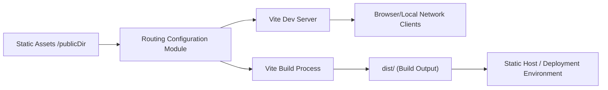

# Routing Configuration

## Overview
This module defines the routing and server configuration for the Vite development and build system used in the project. It specifies how project files are served, where output is generated, and how the local development server behaves. This setup ensures that your application is correctly routed in both development and production environments.

## Key Features
- **Custom Root Directory**: The module sets `src/` as the root directory, ensuring Vite serves and resolves modules from your source code location.
- **Public Assets Handling**: Static assets are sourced from `static/` and made available in your build, supporting efficient asset management.
- **Configurable Base Path**: Uses a relative base path (`./`), which is important when deploying applications to subfolders or static hosts.
- **Adaptive Server Opening**: Automatically opens the browser in development—unless running in a cloud or sandboxed environment—improving developer experience.
- **Network Accessibility**: Server is accessible on your local network, simplifying testing across devices.
- **Output Directory Management**: Outputs built files to `dist/`, empties the directory before building, and includes source maps for debugging.

## System Errors
- **Server Not Accessible**: If the server isn't accessible on the local network, ensure that your firewall settings permit connections and that `host: true` is set correctly.
- **Asset Loading Issues**: Misplaced assets or incorrect `publicDir` settings may cause missing files in production. Verify assets are located in `static/` and referenced with the correct paths.
- **Incorrect Deployment Routing**: If deploying to a subdirectory and routes break, double-check the `base` option is set appropriately relative to your deployment URL.
- **Build Output Missing**: If the `dist/` directory does not populate, confirm that the `outDir` is correctly referenced and you have write permissions.

## Usage Examples

```js
// vite.config.js
export default {
    root: 'src/',
    publicDir: '../static/',
    base: './',
    server: {
        host: true,
        open: !('SANDBOX_URL' in process.env || 'CODESANDBOX_HOST' in process.env)
    },
    build: {
        outDir: '../dist',
        emptyOutDir: true,
        sourcemap: true
    },
}

// Command line (development):
// Run Vite and serve the application using this configuration
// npx vite

// Command line (production build):
// Build the optimized application artifacts
// npx vite build
```

## System Integration

