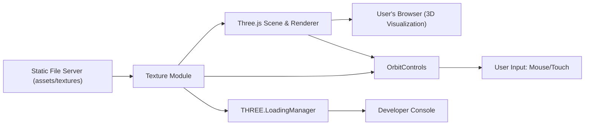

# Texture Module

## Overview
The Texture module enables Three.js applications to load, manage, and apply a variety of image textures to 3D objects in a browser environment. It facilitates the efficient import of different texture types (color, alpha, normal, etc.), connects texture loading with real-time feedback, and integrates seamlessly with Three.js scene setup. The module is essential for achieving rich, realistic visual effects and is typically used in interactive 3D experiences where materials and surface details matter.

## Key Features
- **Texture Loading via LoadingManager**: Efficiently loads images for use as textures while providing feedback on load progress, completion, or errors, improving user experience and debugging.
- **Multiple Texture Channel Support**: Supports a range of standard texture maps, such as color, alpha, height, normal, ambient occlusion, metalness, and roughness, enabling advanced material and lighting effects.
- **Custom Texture Filters and Parameters**: Provides options to adjust texture filtering (e.g., nearest neighbor), mipmapping, and color space, which improves visual quality and performance tuning for specific art styles (e.g., pixel art).
- **Seamless Integration in Three.js Scenes**: Directly binds textures to 3D materials and adds them to Three.js meshes, making it easy to visually render complex objects with detailed surfaces.
- **Interactive Controls**: Integrates with OrbitControls to enable real-time camera movement around textured objects for interactive exploration.

## System Errors
- **Texture Load Error**: Triggered when a texture file fails to load (e.g., missing file, network error).  
  **Resolution**: Check console output from the LoadingManager's `onError` callback for the specific file; ensure texture file paths are correct and files are accessible by the web server.
- **Canvas Not Found**: Occurs if the `<canvas class="webgl">` element is missing from the HTML, leading to rendering failures.  
  **Resolution**: Verify that the `<canvas class="webgl">` exists in your HTML file before initializing Three.js.
- **Invalid Texture Format**: If textures are not in a supported image format (e.g., corrupt, wrong file type), loading will fail.  
  **Resolution**: Confirm that all textures are in standard web image formats (like PNG or JPEG).

## Usage Examples

```javascript
// Import Three.js and controls
import * as THREE from 'three'
import { OrbitControls } from 'three/examples/jsm/controls/OrbitControls.js'

// Set up a loading manager with progress callbacks
const loadingManager = new THREE.LoadingManager()
loadingManager.onProgress = (url, itemsLoaded, itemsTotal) => {
  console.log(`Loaded ${itemsLoaded}/${itemsTotal}: ${url}`)
}

// Create a texture loader managed by the loading manager
const textureLoader = new THREE.TextureLoader(loadingManager)

// Load various textures
const colorTexture = textureLoader.load('/textures/minecraft.png')
colorTexture.colorSpace = THREE.SRGBColorSpace // Correct color rendering
colorTexture.magFilter = THREE.NearestFilter   // Pixelated look

// Typical usage: apply color texture to a mesh material
const material = new THREE.MeshBasicMaterial({ map: colorTexture })
const geometry = new THREE.BoxGeometry(1, 1, 1)
const mesh = new THREE.Mesh(geometry, material)

// Add mesh to scene, set up camera and controls
const scene = new THREE.Scene()
scene.add(mesh)
const camera = new THREE.PerspectiveCamera(75, window.innerWidth / window.innerHeight, 0.1, 100)
camera.position.set(1, 1, 1)
const renderer = new THREE.WebGLRenderer({ canvas: document.querySelector('canvas.webgl') })
renderer.setSize(window.innerWidth, window.innerHeight)
renderer.render(scene, camera)
```

## System Integration


