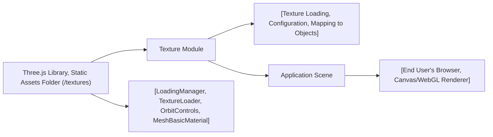

# Texture Module

## Overview
The **Texture Module** provides Three.js-powered functionality for loading, managing, and applying bitmap textures to 3D objects in a browser-rendered scene. It integrates seamlessly with the Three.js ecosystem to support enhanced visual realism, using features such as loading state callbacks, multiple texture types (color, alpha, normal, etc.), and configurable texture properties. The module is typically used when rendering complex 3D models that require texture maps for detail, realism, and special visual effects.

## Key Features
- **Texture Loading with Progress Events**: Utilizes Three.js’s `LoadingManager` for tracking texture load lifecycle—start, progress, completion, and error—enabling responsive feedback or sequencing during asset loading.
- **Support for Multiple Texture Types**: Easily load and assign multiple texture maps, such as color, alpha, height, normal, ambient occlusion, metalness, and roughness, to enhance materials and effects.
- **Texture Configuration**: Provides direct configuration of important texture properties, such as color space, mipmaps generation, filtering modes, and wrapping, to optimize rendering quality and performance.
- **Three.js Scene Integration**: Demonstrates direct application of loaded textures as material maps for 3D mesh objects, leveraging Three.js’s core material and geometry APIs.
- **Interactive Camera Controls**: Bundled with OrbitControls for interactive, smooth camera navigation around textured objects.

## System Errors
- **Texture Load Failure**: Occurs if a texture file is missing, corrupted, or an invalid URL is provided.
  - **Resolution**: Check file paths, ensure files exist in the public directory, and verify correct URL usage. Use the `LoadingManager.onError` callback for custom error handling.
- **Rendering Issues (Black/Untextured Mesh)**: Triggered when texture loading fails silently, or if incorrect texture configuration (e.g., wrong color space) is set.
  - **Resolution**: Ensure texture URLs and file formats are valid, and `colorSpace` is accurately assigned (e.g., ` THREE.SRGBColorSpace` for most images).
- **Performance Degradation**: May arise from large texture files, excessive mipmap generation, or over-filtering.
  - **Resolution**: Use texture filters (`NearestFilter` for pixel art), disable unnecessary mipmaps (`generateMipmaps=false`), and optimize texture sizes.

## Usage Examples

```javascript
// 1. Setup Texture Loader with progress/error callbacks
const loadingManager = new THREE.LoadingManager();
loadingManager.onStart = () => { console.log('Started loading textures'); };
loadingManager.onProgress = () => { console.log('Texture loading in progress'); };
loadingManager.onError = () => { console.error('Error loading texture'); };

const textureLoader = new THREE.TextureLoader(loadingManager);

// 2. Load texture(s) and configure
const colorTexture = textureLoader.load('/textures/minecraft.png');
colorTexture.colorSpace = THREE.SRGBColorSpace;
colorTexture.magFilter = THREE.NearestFilter;
colorTexture.generateMipmaps = false;

// 3. Apply texture to mesh material
const geometry = new THREE.BoxGeometry(1, 1, 1);
const material = new THREE.MeshBasicMaterial({ map: colorTexture });
const mesh = new THREE.Mesh(geometry, material);

// 4. Add mesh to scene and set up camera/controls
scene.add(mesh);
const camera = new THREE.PerspectiveCamera(75, window.innerWidth/window.innerHeight, 0.1, 100);
// Setup controls, renderer, and animate as in main script
```

## System Integration


