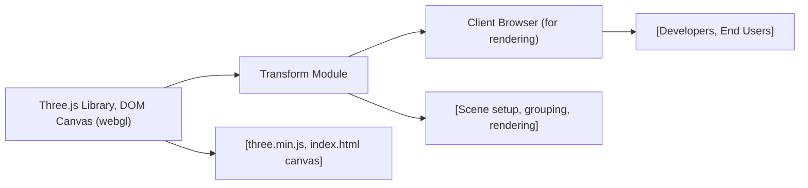

# Transform Module

## Overview
The Transform module serves as a foundational 3D scene setup using Three.js. It demonstrates how to create and manipulate objects within a group, providing basic translation, rotation, and scaling transformations. The module renders a simple, interactive scene with three cubes arranged in a group, showing how group-level transformations affect contained meshes. It is designed to be a starting point for developers who want to understand object manipulation, grouping, and visualization with Three.js.

## Key Features

- **Object Grouping and Transformation**: Enables creation of multiple 3D objects, grouping them, and applying transformations (scale, rotation, translation) at the group level for coordinated movements.
- **Scene Setup and Rendering**: Establishes a Three.js scene, configures perspective camera, and uses a WebGL renderer to display 3D objects in the browser.
- **Axes Helper**: Adds a visual 3D axes indicator to help orient developers within the scene.
- **Responsive Canvas**: Initializes rendering with precise size settings to fit the desired container.

## System Errors

- **Canvas Element Not Found**: If no canvas with the `webgl` class exists in the HTML, Three.js renderer will not attach, resulting in no visible scene.  
  _Resolution_: Ensure `<canvas class="webgl"></canvas>` exists in the HTML.
- **WebGL Not Supported**: On browsers lacking WebGL support, the renderer will not work and may throw errors.
  _Resolution_: Use a modern web browser with WebGL enabled.
- **Unresponsive Scene**: If dimensions in `sizes` do not match actual canvas/container size, rendering may appear distorted.
  _Resolution_: Adjust the `sizes` object or use dynamic sizing for production.

## Usage Examples

```js
import * as THREE from 'three'

// Query the target canvas from the DOM
const canvas = document.querySelector('canvas.webgl')

// Create a new 3D scene
const scene = new THREE.Scene()

// Create a group to apply transformations to multiple objects together
const group = new THREE.Group()
group.scale.y = 2         // Scale group vertically
group.rotation.y = 0.2    // Rotate group on Y axis
scene.add(group)

// Add three cubes at different positions within the group
for (let i = -1; i <= 1; i++) {
    const cube = new THREE.Mesh(
        new THREE.BoxGeometry(1, 1, 1),
        new THREE.MeshBasicMaterial({ color: 0xff0000 })
    )
    cube.position.x = i * 1.5
    group.add(cube)
}

// Add an axes helper for orientation
const axesHelper = new THREE.AxesHelper()
scene.add(axesHelper)

// Set up camera parameters
const sizes = { width: 800, height: 600 }
const camera = new THREE.PerspectiveCamera(75, sizes.width / sizes.height)
camera.position.z = 3
scene.add(camera)

// Set up and use WebGLRenderer to display the scene
const renderer = new THREE.WebGLRenderer({ canvas })
renderer.setSize(sizes.width, sizes.height)
renderer.render(scene, camera)
```

## System Integration

